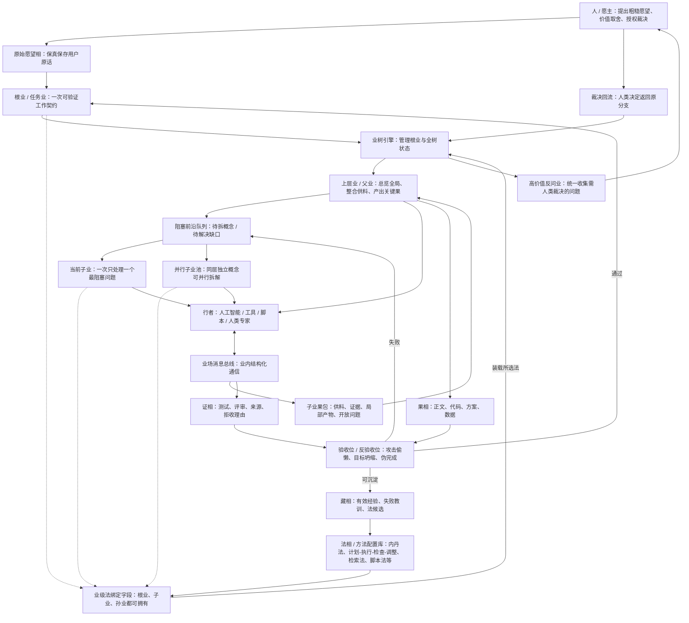
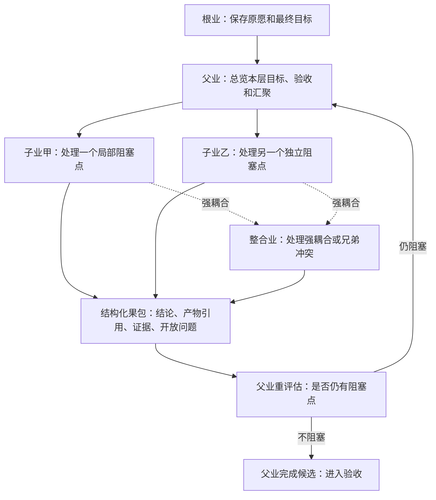
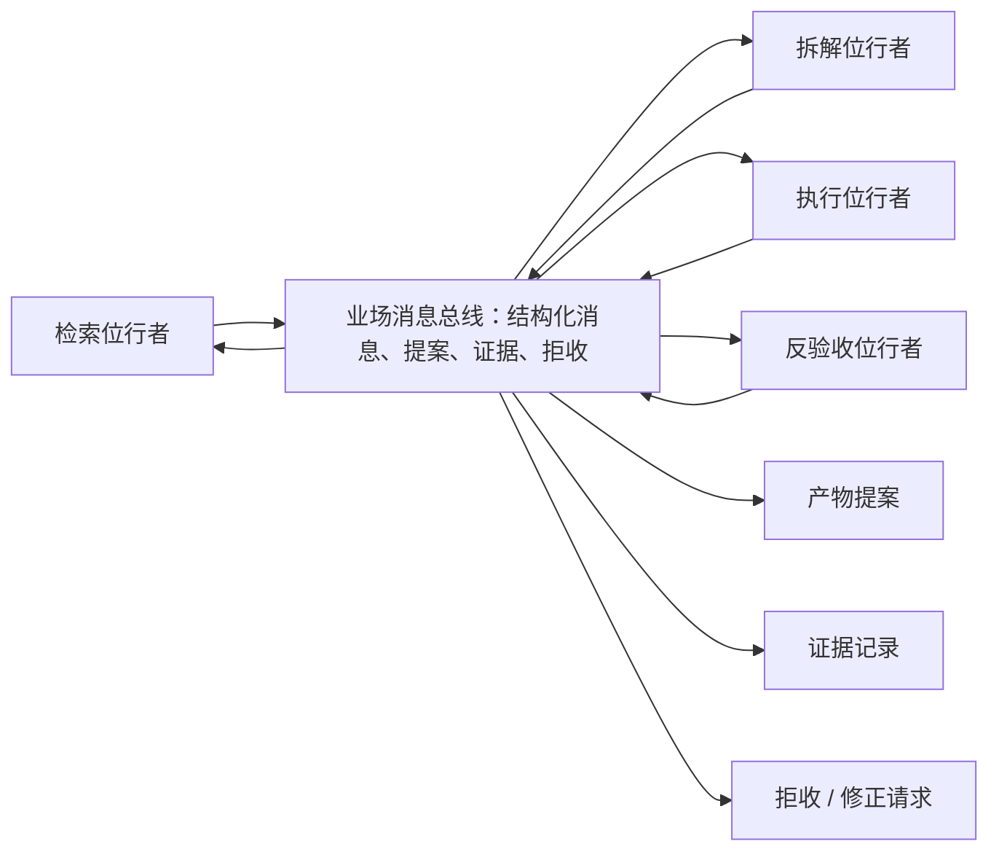

# 人工智能软件社会相业架构

> 状态：当前唯一真相源。
> 作用：约束金箍的目标、架构、代码、测试、评审和迁移方向。
> 原则：任何新概念、新模块、新流程若不能服务能力补全目标，默认不应进入核心架构。

## 0. 一句话

金箍的核心目的不是制造一个更会顺从的代理，也不是把专家已经会做的事自动化，而是构建一个能力补全型人工智能支架：让只有粗糙愿望、缺少专业能力的人，也能在人工智能、工具、证据、验收和人类裁决的共同作用下，把想法推进为可检查、可迭代、可交付的现实成果。

更短地说：

> 金箍要让普通人越过自身能力短板，把“我想要但我不会做”变成“我能判断、能推进、能交付”。

人工智能软件社会不是“代理聊天室”，也不是“自动化路线平台”，而是一个以运行库和大对象文件为可转移载体、以工作契约为变化核心、以证和质量为闭环的外骨骼系统。

用新的术语说：

> 人起愿，相承载世界，业推动变化，行者承业而行，法提供能力，律定边界，果必须携证，证入藏并反过来成为新的因缘。

本文中的佛教式命名只是工程隐喻，不引入宗教判断。命名目标是让抽象足够统一、可组合、可扩展，并避免工程实现被既有概念误导。

### 0.1 根本服务对象

金箍首先服务的不是已经能清晰拆任务、写提示词、写法、定标准、审结果的专家用户。

金箍的根本服务对象是：

- 只有愿望但不知道该怎么表达的人。
- 有想法但缺少领域知识、方法论、审美、工程能力或验收标准的人。
- 能做最终价值判断，但不能独自完成专业路径设计的人。
- 不应被人工智能替代判断权，却需要人工智能扩展行动能力的人。

专家用户也应该受益，但专家效率提升不是最高目标。最高目标是能力补全。

### 0.2 能力补全闭环

金箍的基本闭环不是“用户下令 -> 代理执行 -> 输出答案”，而是：

```纯文本
愿望进入
  -> 保存为可引用材料
  -> 诊断能力缺口
  -> 获取或生成必要知识
  -> 合成临时能力
  -> 形成可执行工作契约
  -> 召集行者执行
  -> 产生候选成果
  -> 用证据和验收标准检验
  -> 把关键裁决点交还给人
  -> 沉淀为新的材料、方法和经验
```

这个闭环允许代理、自动化路线、工具、脚本、模型和人类专家参与，但它们都不是根目的。它们只是能力补全闭环中的行者或方法。

### 0.3 设计红线

以下情况视为偏离总纲：

- 只让强用户更强，却没有降低弱用户的能力门槛。
- 要求用户先写好法、标准、流程，系统才会工作。
- 把聊天上下文当唯一真相源。
- 让代理同时决定目标、记忆、拆分、执行、验收和完成声明。
- 为简单请求强行起复杂业、拆子业、建重型验收。
- 把因、愿、缘、律、位、法、果、证当成每次都要展开的表格，而不是按风险和缺口生成的契约槽。
- 用大量日志替代可用状态、证据和裁决界面。
- 把所有不确定问题都推给人类，制造决策地狱。
- 为术语完整性保留概念，而不是为能力补全保留概念。

### 0.4 架构必须长出的能力

金箍的核心架构至少要长出这些能力，而不是只靠提示词自觉：

| 能力 | 说明 |
|---|---|
| 愿望保真 | 保存人的原始表达、偏好、犹豫和价值判断，不让人工智能猜测覆盖源头 |
| 缺口诊断 | 判断完成目标缺哪些知识、标准、方法、材料、工具和角色 |
| 材料获取 | 在需要时主动收集事实、案例、约束和背景，并保留来源与可信度 |
| 能力合成 | 为当前目标生成可执行的临时法、检查表、执行规程或领域方法，而不是要求用户预先会写 |
| 工作契约 | 把模糊愿望转为可执行、可验收、可拒收、可复盘的工作单元 |
| 行者约束 | 使用代理的生成力和工具力，但不让代理独占状态、目标、记忆、验收和责任 |
| 验收生成 | 在用户不会定标准时，帮助生成可解释的候选标准，并允许人类修正 |
| 证据闭环 | 重要结论、成果和状态变化必须携带证据、理由、来源或测试结果 |
| 裁决减负 | 不把所有细节都推给人，只把价值取舍、风险授权和无法替代的判断呈现给人 |
| 经验沉淀 | 将有效材料、方法、标准和失败教训沉淀为后续可复用能力，而不是污染长期记忆 |

### 0.5 代表性验收场景

代表性验收场景是：

> 一个完全不懂写作的孩子，只给出一句话：“如果某个平行宇宙中人类是蛋生的会怎样？”金箍应帮助他补齐必要知识、生成写作方法和验收标准、设计执行路径、产出候选小说，并把他真正能判断的选择交还给他，而不是要求他先成为网文专家。

这个场景不是唯一产品方向，但它暴露了金箍必须解决的核心矛盾：用户没有能力定义专业路径；人工智能有能力生成路径，但容易自说自话；系统必须补齐能力，同时保护人的愿望、判断权和可理解性。

## 1. 为什么需要相业架构

系统不应以固定路线或长期代理会话为根，而应以一次次可验证工作为核心。

常见根概念都有明显缺陷：

| 根概念 | 问题 |
|---|---|
| 固定路线 | 容易先画路线，再把真实问题硬塞进节点 |
| 长期代理会话 | 容易把状态、藏、权限、任务和责任混在会话里 |
| 能力集合 | 容易只描述能做什么，却不描述本次为何做、做到什么算好 |
| 任务标题 | 太空，不足以交接、验收、拒收和追责 |

相业架构把核心概念定义为 `业`：

> 业 = 一次有原因、有目标、有条件、有边界、有方法、有行、有果、有证的可验证工作契约。

这个命名更贴近本质：

- 它不是行者。
- 它不是路线节点。
- 它不是上下文包。
- 它是让稳定存在发生变化的一次工作契约。

与业对应的是 `相`：

> 相 = 一切可保存、可引用、可呈现、可转移、可比较的稳定存在。

最终根模型不是多个旧概念的拼装，而是：

> 一切稳定存在皆为相；一切相之变化皆由业发生。

行者、位、法、律、藏、证、果都可以是相；它们的生成、修改、验证、废弃才是业。

### 1.1 与代理和固定路线的关系

金箍不以“不同于代理”为目的。为了故意不同而不同没有价值。

金箍应兼容代理和固定路线的优点：

- 代理适合开放推理、生成候选路径、调用工具、处理模糊问题。
- 固定路线适合稳定、可重复、低分歧、边界清晰的工作。

但金箍不能退化为代理外面套一层日志，也不能退化为更复杂的路线画布。

判断一个设计是否成立时，不问“它是不是看起来更像相业”，而问：

> 它是否比普通代理或固定路线更能帮助低能力起点的人完成高能力要求的目标？

若答案是否定，该设计应被修改、降级或删除。

## 2. 三权分立与五条根律

人工智能支架的核心危险不是“任务拆得不够细”，而是同一个行者同时拿走三种权力：

```纯文本
定义目标的权力。
改变状态的权力。
宣告完成的权力。
```

相业架构要成立，首先必须拆开这三种权力。

| 权力 | 危险形态 | 相业中的约束方向 |
|---|---|---|
| 定义目标的权力 | 人工智能把人的粗糙愿望改写成自己的目标 | 愿主保留价值源头；高价值分支回到人类或明确授权 |
| 改变状态的权力 | 行者在聊天或局部执行中直接污染相 | 无业不改相；行者只能提交候选变化 |
| 宣告完成的权力 | 局部通过冒充全局完成，人工智能自称交付 | 完成权归属于责任范围对应的上层业，果必须携证并验收 |

基于三权分立，当前五条根律是：

| 根律 | 内容 | 主要防守对象 |
|---|---|---|
| 愿源保真律 | 人是愿、价值、授权和责任的源头；人工智能只能提出候选解释、候选目标、候选取舍，不能替人改写高价值愿望 | 目标被偷换 |
| 立业变更律 | 一切稳定相的变化，都必须通过业发生；无业不改相 | 状态被乱改 |
| 候选隔离律 | 行者、法、工具、子业只能提交候选变化；候选果、候选证、候选分业、候选法更新都不能自动成为真相 | 执行者直接占有真相 |
| 缘备显缺律 | 业执行前必须显式声明并满足必要缘；缘不足时必须暴露缺口，不得靠幻觉、隐式上下文或大上下文强塞继续执行 | 缺材料硬执行和上下文幻觉 |
| 证成归属律 | 果必须携证；完成声明属于责任范围对应的业，局部业不能宣告上层业完成 | 局部冒充全局完成 |

五条根律对应三权分立：

| 权力 | 根律 |
|---|---|
| 定义目标的权力 | 愿源保真律 |
| 改变状态的权力 | 立业变更律 + 候选隔离律 |
| 宣告完成的权力 | 证成归属律 |
| 执行依据的可靠性 | 缘备显缺律 |

相业还有一组公理，但它们不是根律：

```纯文本
一切可被保存和引用者，皆为相。
一切相之变化，皆由业发生。
业由因起，向愿而行。
业由律定界，依位召行者，用法而行。
行成其果，果必有证，证可入藏。
```

这些公理定义语言结构；五条根律定义系统不可绕过的控制边界。实现中必须优先保护根律，而不是为了术语完整性堆概念。

### 2.1 总体结构图



## 3. 核心术语

### 3.1 总表

| 名称 | 定义 | 不是 |
|---|---|---|
| 人 | 愿望、品味、授权、责任、最终裁决的源头 | 不是系统内普通相，不是被 人工智能 管理的资源 |
| 相 | 可保存、可引用、可呈现、可转移的稳定存在 | 不主动改变自己 |
| 业 | 让相发生变化的一次可验证工作契约 | 不是代理会话，不是固定路线节点 |
| 因 | 用户表达、情绪、痛点、问题种子、材料、冲突、环境信号 | 不是目标 |
| 愿 | 本次业想达成的目的、方向、所求 | 不是因相材料 |
| 缘 | 支持业发生的环境、依赖、上下文、可用资源、时机 | 不是业本身，不是变换动作 |
| 律 | 权限、风险、质量、成本、伦理、边界、不可越界事项 | 不是能力方法 |
| 位 | 行者承接某个业时所处的责任位置和判断视角 | 不是行者本体 |
| 法 | 可复用的能力、方法论、工具链、模板、套路、规程 | 不是律边界 |
| 行者 | 可承接业并执行行的代理，会话、模型、人、工具、脚本、服务都可成为行者 | 不是业的真相源 |
| 行 | 实际发生的推理、调用、生成、修改、评审、仲裁、搬迁 | 不是条件 |
| 果 | 业成熟后产生的结果、方案、代码、文档、决策、状态变化 | 不等于可信完成 |
| 证 | 为什么相信果成立、失败或需要降级的依据 | 不等于漂亮解释 |
| 藏 | 证、经验、偏好、环境知识、失败复盘的沉淀处 | 不是永远正确的真理库 |
| 镜 | 把复杂相和业网投影成人能理解的进度、风险、决策视图 | 不拥有真相 |

### 3.2 因和愿必须拆开

因相信息和目标所求必须分开。否则系统分不清“发生了什么”和“想达成什么”。

| 项 | 含义 | 示例 |
|---|---|---|
| 因 | 触发业的材料、张力、痛点、表达、情绪、环境事实 | “我觉得架构不对”“文档看不懂”“代码和文档冲突” |
| 愿 | 本次业希望走向的目标 | “找到更简单的抽象”“让文档成为未来重构真相源” |

同一个因可以导向不同愿：

- 用户说“这个文档不对”。
- 愿一：找出文档漏洞。
- 愿二：重写文档。
- 愿三：设计评审机制。
- 愿四：暂停设计，回到意图澄清。

如果不拆开，人工智能 会直接把用户表达当任务，导致过早执行、方向错误、反复返工。

### 3.3 缘不是业

`缘` 只表示促成业发生的条件，不表示整个工作契约。

缘可以包括：

- 当前可见上下文。
- 可调用模型。
- 可用工具。
- 已存在证。
- 可用预算。
- 依赖关系。
- 外部时机。
- 上下游相。

因此，不能把整个工作契约叫“缘”。缘只是条件，完整工作契约是业。

### 3.4 行者不是模型

行者不是单纯模型。带独立上下文、位、工具、边界和任务的代理会话，更接近这里的 `行者`：

> 行者 = 模型 + 会话上下文 + 工具权限 + 当前状态 + 可承接业的代理身份。

例如：

- 一个 通用对话模型 会话。
- 一个 长文模型 项目会话。
- 一个本地脚本。
- 一个代码搜索工具。
- 一个外部 接口。
- 一个真实人类专家。
- 一个自动测试运行器。

但行者本身仍然是相。行者可以被记录、比较、授权、禁用、替换、评估。真正推动变化的是业。

### 3.5 位不是人设扮演

`位` 不是人格设定，而是职责位置。

同一个行者可以在不同业中处于不同位：

| 行者 | 业 | 位 |
|---|---|---|
| 通用对话模型会话甲 | 攻击架构方案 | 反方评审位 |
| 通用对话模型会话甲 | 重写文档 | 文档架构位 |
| 人类用户 | 裁决方向 | 愿主位 |
| 测试脚本 | 验证 标记文本 链接 | 校验位 |

位定义的是：

- 看什么。
- 对什么负责。
- 不能越过什么边界。
- 何时必须上报。
- 用什么标准判断。

### 3.6 法不是律

`法` 表示可复用能力，也包含方法论。

法是可复用的履约能力：

- 架构攻击法。
- 意图显影法。
- 代码反哺文档法。
- 风险评估法。
- 对抗评审法。
- 搬迁切片法。
- 文档排版法。
- 自动测试法。

法说明怎样成事，律说明哪里不可越界。两者混用，会把“能力方法”和“边界限制”混成一类东西。

### 3.7 律包含质量，但不等于质量

律是边界系统。它包括：

- 权限律：谁能做什么。
- 风险律：什么情况必须升级。
- 质量律：什么算好、什么硬失败。
- 成本律：预算、时间、资源上限。
- 安全律：隐私、外部副作用、不可逆操作。
- 根律：人类写入、人工智能 只读的最高边界。

质量属于律。某个业可以引用一个或多个质量律。

### 3.8 术语最小 结构定义、生命周期和反例

本节不是实现代码，而是术语契约。后续任何文件协议、界面投影或运行时实现，都不能违背这里的最小结构。

| 名称 | 最小 结构定义 | 生命周期 | 反例 |
|---|---|---|---|
| 人 | `人编号`、本愿、授权范围、不可让渡裁决、责任归属 | 表达本愿、授权、裁决、复盘、调整授权 | 把人当普通资源排班；让 人工智能 替人决定价值取舍 |
| 相 | `相编号`、相类、版本、状态、正文引用、上游引用、校验摘要、所有者 | 草稿、有效、被引用、被更新、被取代、废弃、归档 | 未保存的临时上下文；无法追溯来源的口头判断 |
| 业 | `业编号`、因、愿、缘、律、位、法、行者、风险、状态、果、证 | 拟立、待承接、运行中、待验收、完成、拒收、仲裁、废弃 | 一句聊天命令；只有标题、没有验收标准的任务 |
| 因 | 来源、原文、发生时间、张力、可信度、敏感等级、关联相 | 采集、保真保存、归类、绑定业、失效或入藏 | 人工智能 事后脑补的动机；把愿望误写成事实 |
| 愿 | 目标状态、不做范围、成功标准、优先级、愿主、可变更条件 | 显影、确认、拆分、升级、达成、撤销、重写 | 把用户原话直接当最终目标；只有口号没有取舍 |
| 缘 | 上下文引用、可用资源、时间窗口、预算、依赖、外部条件 | 发现、挂载、验证、过期、替换、解除挂载 | 把条件当工作本身；把过期上下文继续当当前条件 |
| 律 | 律类、适用范围、强度、可执行判定、升级条件、违规后果 | 草拟、批准、启用、命中、修订、废止 | 只写“质量要高”；只有建议没有拦截或升级条件 |
| 位 | 职责位置、观察范围、验收权、拒收权、上报条件、越界边界 | 创建、分配、承接、履责、交还、冻结 | 人格扮演；把同一行者长期绑定为固定身份 |
| 法 | 适用场景、前置条件、操作步骤、需要的相、生成的果、验证方式 | 创建、试用、通过、复用、降级、废弃 | 一段提示词技巧；没有适用边界和验收方式的经验 |
| 行者 | 行者类型、能力边界、上下文边界、工具权限、信用、隔离策略 | 注册、授权、承接、执行、评估、降权、禁用 | 只写模型名；没有独立上下文和权限边界的调用 |
| 行 | 动作类型、开始时间、结束时间、调用记录、变更摘要、失败记录 | 计划、开始、暂停、恢复、完成、失败、回滚 | 只写“已处理”；没有记录实际改变了什么 |
| 果 | 结果引用、消费者、状态、变更范围、假设、未决点、下游用法 | 生成、待验、通过、拒收、被消费、被取代、归档 | 漂亮文本；无法被下游业使用的结论 |
| 证 | 断言、验证方式、证相引用、验证者、置信度、限制、反例 | 生成、绑定果、复核、增强、失效、归档 | 自信声明；“看起来没问题” |
| 藏 | 沉淀内容、来源、适用范围、版本、置信度、过期条件、取代关系 | 候选、批准、可检索、被引用、衰减、过期、清理 | 原始聊天记录直接长期复用；没有范围的偏好 |
| 镜 | 投影类型、来源相、刷新时间、受众、决策点、风险提示 | 生成、刷新、展开、收起、失效、重建 | 把仪表盘当真相源；只展示进度不展示证 |
| 信 | 被评估相、适用条件、样本数量、评分、衰减、最近反例 | 初始化、积累、上升、下降、冻结、重评 | 给行者一个永久全局分数；不区分场景的信任 |
| 险 | 风险来源、等级、影响面、累积值、阈值、负责人、缓解方式 | 发现、计量、累积、升级、缓解、关闭、复盘 | 只写“小心”；多个低风险业合成高风险却不记录 |
| 业网 | 业引用、关系类型、关系方向、当前状态、查询视图、冲突记录 | 生长、查询、修正、拆分、合并、归档 | 预先画死的路线图；没有果和证支撑的连线 |

最小 结构定义 的目的不是把系统做重，而是保证每个概念都能被保存、迁移、拒收、复盘和演进。轻量业可以只填最小字段，但不能破坏字段语义。

## 4. 业的结构

### 4.1 标准业

标准业的结构是：

标准业是完整表达形态，不是所有请求的默认起步形态。简单、低风险、可逆、无下游依赖的工作，可以压缩为轻量业；只有当交接、复盘、并发、风险、验收或下游消费真实需要时，才展开完整结构。

| 组成 | 必须回答的问题 |
|---|---|
| 因 | 这次业因何而起，因相和张力是什么 |
| 愿 | 本次业要达成什么，不达成什么 |
| 缘 | 当前有哪些上下文、资源、依赖、时机 |
| 律 | 权限、风险、质量、成本、边界是什么 |
| 位 | 需要什么职责位置来承接判断 |
| 法 | 可用什么方法、能力、模板、工具链 |
| 行者 | 谁或什么来承接本次业 |
| 行 | 实际如何变换、生成、修改、评审、仲裁 |
| 果 | 产生什么结果，给谁使用 |
| 证 | 为什么相信果成立，失败或降级如何记录 |

简化表达：

> 业由因起，向愿而行；缘助其成，律定其界；行者依位用法，行成其果，果必有证。

因、愿、缘、律、位、法、果、证是语义槽，不是强制独立表、独立文件、独立子业或独立验收节点。第一版必须允许它们在同一业记录中按需压缩；只有当某一槽变成复用对象、争议对象、权限对象、验收对象或下游依赖时，才上浮为独立相或派生业。

### 4.2 轻量业、标准业、高风险业

不是每个业都要填满大表。否则架构会拖死执行。

| 等级 | 适用场景 | 最低要求 |
|---|---|---|
| 轻量业 | 低风险、可逆、局部、小成本动作 | 原始触发、目标、边界、候选果、最小证 |
| 标准业 | 需要交接、复盘、下游依赖的工作 | 展开因、愿、缘、律、位、法、行、果、证 |
| 高风险业 | 高成本、不可逆、外部副作用、影响多人或长期决策 | 标准业 + 风险积累 + 独立验收 + 人类授权或仲裁 |

“一次做对”不是一次生成完美，而是用匹配风险等级的业结构，避免错误扩大。

是否分业、是否建立独立验收业、是否上浮为法或藏，都由当前缺口和风险决定。为了概念完整而拆，是错误；为了避免局部执行者全局迷失而不拆，也是错误。判断标准只有一个：不拆是否会阻塞执行、污染上下文、削弱验收或扩大风险。

### 4.3 携证之果

果不能只是文本。可信果必须携证。

一个携证之果至少说明：

- 引用了哪些因。
- 依赖哪些缘。
- 遵守哪些律。
- 由哪个行者以什么位、用什么法完成。
- 哪些判断有证。
- 哪些判断只是推测。
- 哪些地方未验证。
- 下游如何消费。
- 失败时如何拒收、重做或降级。

这解决的是 人工智能 常见问题：新生成时看似完整，修改时顾此失彼，留下大量过时幻觉。

## 5. 相的分类

相不是静态文件。它是一切可保存、可引用、可呈现的稳定存在。

| 相类 | 内容 |
|---|---|
| 因相 | 用户表达、情绪、痛点、张力、环境事实、问题材料 |
| 愿相 | 本愿、阶段愿、业愿、取舍偏好 |
| 律相 | 根律、权限律、风险律、质量律、成本律、安全律 |
| 位相 | 愿主位、架构位、反方位、执行位、校验位、仲裁位 |
| 法相 | 方法论、能力集合、工具链、模板、脚本、评审套路 |
| 行者相 | 代理会话、模型、工具、人类专家、脚本、外部服务 |
| 果相 | 文档、代码、方案、数据、决策、状态变更 |
| 证相 | 引用、测试、评审、验收、拒收、失败记录 |
| 藏相 | 经验沉淀、偏好、失败复盘、环境知识 |
| 镜相 | 给人类看的进度、风险、证、决策点和组织状态 |
| 信相 | 行者、法、位、果在特定条件下的过往可信度 |
| 险相 | 风险记录、风险积累、不可逆动作、外部副作用 |

所有相都可以作为业的因、缘、律、法、位、果或证被引用。

## 6. 业网，而不是固定路线

业网不是预设固定路线。

传统路线图的问题是：

- 容易先画固定路线，再把工作塞进去。
- 容易把节点成功当成真实成功。
- 容易将复杂协作压成单向自动化管线。
- 容易让人类变成审批节点，而不是愿源和裁决者。

相业架构只承认 `业网`：

> 业网 = 多个业通过因、缘、果、证、律、拒收、修正、仲裁、升级等关系自然形成的引用网络。

业网不是根对象，而是关系投影。

业之间可以有这些关系：

| 关系 | 含义 |
|---|---|
| 引用 | 一个业引用另一个业的果或证 |
| 派生 | 一个业生成后续业 |
| 评审 | 一个业检查另一个业的果 |
| 拒收 | 下游业声明上游果不可用 |
| 修正 | 新业修正既有业之果 |
| 仲裁 | 仲裁业裁决多个业之间的冲突 |
| 升级 | 风险、价值、授权问题升级给更高位或人类 |
| 废弃 | 果或藏被标记为过时、冲突或不再适用 |

运行时看起来可能像路线图，但本质不是路线驱动，而是：

> 业引用业，业生成业，业评审业，业修正业，业沉淀新律。

## 7. 代理会话与业的边界

代理会话不是模型，而是带独立上下文、位、工具、边界和任务的行者相。

在简单任务中：

> 代理会话 + 契约文件 ≈ 一个业被一个行者承接。

此时两者差别不大。

差异出现在复杂协作中：

| 问题 | 代理会话驱动 | 业驱动 |
|---|---|---|
| 工作状态在哪里 | 主要在代理会话上下文 | 主要在业记录、果、证、藏中 |
| 行者能否替换 | 替换后容易丢失上下文 | 可替换，只要业记录完整 |
| 多行者如何协作 | 行者之间对话协调 | 多行者承接同一业或派生业，结果回写同一业网 |
| 失败如何复盘 | 翻聊天记录 | 查因、愿、律、行、果、证 |
| 下游能否拒收 | 往往不明确 | 下游业可按律拒收果 |
| 质量标准在哪里 | 提示词或代理设定里 | 律相中，可被多个业复用 |
| 长期演化靠什么 | 代理藏相 | 藏、证、信、险和相版本 |

一句话：

> 代理会话驱动让代理推动工作；业驱动让工作契约调度代理。

业驱动不是不要代理，而是不让代理会话成为系统唯一真相。

## 8. 运行机制

### 8.1 从人类模糊表达到业网

典型运行顺序：

1. 人发出表达：愿望、痛点、情绪、困惑、目标或命令。
2. 系统记录因相：保留原始表达，不急着解释成任务。
3. 显影业启动：追问、类比、反例、取舍测试，识别真实愿。
4. 立业：把本次可执行变化写成业。
5. 配缘：挂载必要上下文、资源、依赖、过往记录和可用行者。
6. 奉律：引用根律、质量律、风险律、权限律。
7. 定位：选择需要的位，如架构位、反方位、执行位、仲裁位。
8. 取法：选择可用方法论、能力集合、工具链。
9. 召行者：选择代理会话、模型、脚本、工具、人类专家或外部服务。
10. 行：执行变换。
11. 成果：生成果相。
12. 留证：验收、测试、引用、拒收、失败、降级都写入证。
13. 入藏：可复用经验进入藏，过时内容打废弃标记。
14. 投镜：将进度、风险、决策点呈现给人类。
15. 继续生业：果、证、藏成为新业的因缘。

### 8.2 人类什么时候介入

人类不是每个步骤的审批员。人类介入点应集中在：

| 场景 | 为什么必须介入 |
|---|---|
| 愿不清 | 系统无法判断用户真正想要什么 |
| 价值冲突 | 涉及取舍、品味、人生方向、组织方向 |
| 授权边界 | 需要花钱、发布、删除、对外承诺、访问敏感资源 |
| 不可逆风险 | 影响外部世界或难以回滚 |
| 高分歧 | 多个行者、多个位或多个法得出强冲突结论 |
| 长期承诺 | 影响未来组织、产品、法律、伦理或声誉 |

人类是愿主，不是路线节点。

### 8.3 根律与机器可执行律

自然语言根律给人看，但不能直接当运行时硬拦截条件。

例如：

| 人类可读根律 | 机器可执行律 |
|---|---|
| 不要破坏用户资产 | 禁止无备份删除指定路径；修改前必须生成检查点 |
| 不要泄露隐私 | 敏感目录不可外发；外部 接口 调用前必须脱敏或请求授权 |
| 高风险需要确认 | 成本超过阈值、对外发布、删除、支付、发送消息必须暂停 |
| 质量不能靠自称完成 | 高风险果必须有独立证、下游可拒收、人类可抽检 |

根律由人类写入，人工智能 只读。普通业不能修改根律；修改根律必须通过人类授权的启动级动作。

### 8.4 质量与拒收

质量不是“优化一下”。质量属于律。

每个重要业至少要声明：

- 最低可交付线。
- 优秀标准。
- 硬失败条件。
- 谁能验收。
- 下游如何消费。
- 下游如何拒收。
- 失败后重做、拆分、换行者、升级还是停止。

下游拒收不是情绪反馈，必须基于律：

> 下游业只能以“上游果不满足哪条律、缺少哪类证、无法作为哪类因缘”为理由拒收。

拒收后可派生：

- 修正业。
- 仲裁业。
- 补证业。
- 拆分业。
- 升级业。
- 废弃业。

### 8.5 风险积累

风险不是单业字段，而是险相和险证的累积。

低风险业串联可能变成高风险：

- 多次小额调用累计成高成本。
- 多次局部修改累计成大范围架构漂移。
- 多个低敏信息组合成隐私泄露。
- 多次文档补丁累计成真相源混乱。

因此需要风险评估业：

| 因相 | 果 |
|---|---|
| 当前业、上游果、下游依赖、过往失败、外部副作用 | 风险等级、升级要求、是否允许继续、是否需要人类授权 |

风险评估业也可以由行者执行，但不能绕过根律。

### 8.6 藏的污染与过时幻觉

人工智能 修改已有文件时常见问题是顾此失彼：

- 新章节改了，其他章节仍出现过时概念。
- 文档改了，目录和示例没改。
- 架构名改了，案例仍使用过时名称。
- 过时藏相继续被检索，当成当前真相。
- 上下文里同时存在当前定义和过时定义，人工智能 混用。

因此，重要修改业必须完成两个检查动作；小范围修改可作为同业检查项完成，影响面较大、存在冲突或需要独立验收时，才派生辅助业：

| 辅助业 | 作用 |
|---|---|
| 影响面扫描业 | 找出概念、文件、示例、引用、目录、测试、藏相的影响范围 |
| 过时清理业 | 标记废弃、被取代、仅适用于特定版本、与当前真相冲突、需要重验的藏相 |

藏不是永远正确的沉淀库。每条藏相必须带：

- 来源。
- 版本。
- 适用范围。
- 置信度。
- 创建时间。
- 过期条件。
- 取代关系。
- 反例。
- 最近验证证。

检索到的藏只能作为候选因缘，不能直接当事实。

### 8.7 单个业节点的最小契约

单个业节点不是“任务标题加一点状态”，而是一份最小契约。

这里的“最小契约”指语义最小，不等于每个业都要展开成重型表格。轻量业可以把多个契约面压缩在一条业记录里；标准业和高风险业才逐步展开。契约面用于判断哪些信息应上浮、下沉或只保留引用。

| 契约面 | 标准展开字段 | 方向 |
|---|---|---|
| 意图契约 | `原愿引用`、`目标`、`非目标`、`成功标准` | 上浮 + 下沉 |
| 边界契约 | `范围`、`允许方法`、`禁止动作`、`风险等级`、`预算` | 下沉为主 |
| 执行契约 | `法绑定`、`必要条件`、`输入引用`、`输出结构定义` | 下沉 |
| 验收契约 | `验收标尺`、`证据要求`、`完成权` | 下沉 + 上浮结果 |
| 回流契约 | `开放缺口`、`阻塞类型`、`回退策略`、`人类升级` | 上浮 |
| 证据契约 | `果引用`、`证引用`、`源引用`、`裁决引用` | 只留引用 |

轻量业可以由守门器按根律、边界和最小证检查，不必每次创建独立验收行者。凡是结果会被下游消费、风险升高、影响外部世界、成本不可忽略或存在完成争议时，验收者必须独立于产出者；它可以是规则引擎、测试脚本、静态检查器、人类或独立人工智能会话。高价值或不可逆任务必须再加人类裁决位。

### 8.8 法绑定与法调用帧

任何法都不应继续主要依赖文本自觉执行，而应成为可配置、可校验、可版本化的法相。内丹法、计划-执行-检查-调整、总结法、检索法、脚本法都只是可调用法，不是业树引擎内置中心法。

法默认只是候选经验，不是永真套路库。法进入稳定复用前，必须能被后续果、证、拒收、测试、外部反馈、人类反馈或真实运行结果修正、降级、回退或废弃。没有反馈入口的法，只能作为临时法使用。

需要调用法的业应有自己的法绑定字段；不需要额外方法的轻量业可以不绑定法：

```键值
业编号: 业_001_002
法绑定:
  模式: 继承 | 覆盖 | 不绑定
  所选法集:
    - 内丹法.第一版
    - 网页检索法.第一版
  原因: 本业同时需要概念拆解和外部资料检索
```

任意法都可以嵌套调用其他法，也可以被其他法嵌套调用，但每次调用都必须形成法调用帧，并带输入、输出、验收、回流点、预算、深度或重复检测。

### 8.9 分业机制与多层拆解

复杂任务需要真实业树，而不是把所有层级都压回一个循环业。两层循环只能作为单分支、短周期、无长期并行依赖时的执行退化形态，不能作为业树引擎的根结构。

当前实现判断是：

```纯文本
结构上：运行库保存真实父子业树，每个业有父业编号、根业编号、责任范围和完成权。
执行上：业树引擎可以按阻塞前沿调度当前活跃子业，但不能丢失父子层级。
上下文上：上层业看全局目标、验收和汇聚；下层业只看本层输入引用、局部目标和局部验收。
分支上：同层独立阻塞点可以并行分业；强耦合阻塞点必须合并、上收或插入整合业。
```



分业不应由行者自由决定，而应采用“人工智能提议，代码守门，业树引擎登记”。人工智能可以提出分业申请，但守门器必须检查：

```纯文本
是否阻塞父业执行。
是否阻塞父业验收。
是否能产出独立果。
是否有明确验收标准。
是否和已有子业重复。
是否超过深度、时间、成本预算。
是否可以直接复用已有法或藏。
是否只是装饰性概念拆分。
```

必须分业的情况包括阻塞执行或验收、需要外部检索或实验、需要不同位的行者、产物足够大导致父业上下文污染、验收失败原因指向可隔离问题。禁止为了概念完整性、无独立产物、无验收标准、无法被父业消费、已有法或藏可直接解决的事项分业。

长篇小说、大工程代码这类需要全局一致性的工作，最终正文、最终差异、最终发布声明默认留在上层业。子业负责供料、验证、局部实现或接口清晰的局部草稿；如果子业之间反复依赖未定稿，说明切分错误，应合并、上收或插入整合业。

最短规则：

> 上层业总览成事，子业供料证成；子业可以做局部产物，但不能宣告全局完成。

### 8.10 高价值反问与裁决回流

高价值反问不是随便打断，而是由业树引擎统一管理的高价值问题收集器。

| 条件 | 含义 | 默认动作 |
|---|---|---|
| 高价值选择 | 不同答案会导致不同长期走向、责任或资产结果 | 先拦截，进入高价值反问业 |
| 不可逆操作 | 回滚代价高、影响外部世界或难以恢复 | 强制上交人类裁决 |
| 价值冲突 | 审美、偏好、伦理、授权、责任发生冲突 | 不让模型单独代理决定 |
| 高风险授权 | 需要花钱、发布、删除、对外承诺、访问敏感资源 | 必须问人 |
| 语义不确定但后果大 | 模型也无法给出足够可信的代理判断 | 暂停并汇总问题 |

模型可以代理低价值、低风险、可逆、边界清晰的局部效率判断；高价值、不可逆、价值冲突、高风险授权必须上交人类愿主。人类裁决后必须回流到原分支，不能只停留在“问过人了”。

高价值筛选不能依赖单一代码阈值。成本、删除、发布、外部消息、敏感资源访问、不可逆写入这类硬信号，适合由守门器用规则和阈值直接拦截；审美方向、价值冲突、长期承诺、语义取舍这类软信号，不能假装代码可以直接判断。

软高价值问题必须通过“高价值显影协议”处理：模型只能提出候选判断，并把影响对象、可选分支、预期后果、不可逆点、受影响的人、证据覆盖、未知项、建议裁决问题写成结构化结果。守门器不判断价值本身，只检查这些字段是否齐全、是否带证、是否有可观察或可量化代理指标；不齐全则阻塞，齐全后进入人类裁决或明确授权的代理裁决。频繁误报或漏报必须写入证，并反过来修正高价值显影法和风险律。

### 8.11 业内多行者通信与业间果包

业内部多个行者可以通信，但不能自由群聊改状态。



业内用内存消息总线协作，业间用结构化果包交接，状态迁移只由业引擎执行，自由对话不能直接改变业状态。业之间不应直接传文件，也不应共享一个大文件。业间传递的是结构化果包：果引用、版本、校验码、摘要、主张、证据、开放问题和上下文回流。

### 8.12 验收与失败回流

验收不是结尾说明，而是控制信号。

```纯文本
核心验收不通过，不得结束。
完整产物不完整，不得通过。
代码没运行，不能说软件可用。
章节没正文，不能说黄金三章完成。
人工智能自评不能冒充外部反馈。
```

验收必须可量化验证。不能把“质量高”“更好看”“更合理”“更完整”直接当验收标准；必须转成可观察信号、量化代理指标、阈值、样例、反例、检查表、评分尺、样本比例或可复核的对比判断。无法由程序直接判断的审美、价值和市场类目标，也必须先形成可计数、可抽样、可对照、可由人裁决的验收协议；不能形成量化验证协议的内容，只能算开放缺口或价值裁决点，不能算验收完成。

证必须分硬度。真实运行结果、自动测试、静态检查、外部来源、人类反馈、真实用户反馈、独立评审都可以成为证；人工智能自评只能作为弱证，不能单独支撑高风险完成。外部证只增强“为什么相信果成立”，不取得定义目标、改变状态或宣告完成的权力；三权仍由愿主、业引擎和责任业分立守门。

失败后必须进入一种状态：修正、回退、补证、仲裁或废弃。验收失败不能被总结成“仍有改进空间”后结束；必须回到业状态机。

## 9. 运行态承载形态

第一版不是把核心状态拆成大量小文件，也不是把每一种相类都拆成一张物理表，而是收敛为四个物理载体：

```纯文本
.金箍/
  运行态/
    金箍运行库.数据库
    果库/
      <果编号>/
        正文.*
        附件/
    导出/
      人类可读快照/
      人类可读报告/
```

| 物理载体 | 保存内容 | 约束 |
|---|---|---|
| 业表 | 业编号、父业、根业、因、愿、范围、状态、律引用、法引用、责任范围、完成权、阻塞点、验收口径 | 一切稳定相变化必须归属某个业 |
| 相表 | 相编号、相类、状态、结构版本、内容版本、位置、校验码、来源、适用范围、所有者、上游引用 | 原愿、果、证、法、律、位、藏、镜、信、险等都先作为相类，不先拆成独立表 |
| 事件表 | 立业、预检、缺口声明、行者运行、候选提交、候选接收、拒收、反问、裁决、完成、重开、废弃、风险升级 | 只追加；所有状态迁移都从事件重放 |
| 大对象库 | 长文本、代码包、图片、附件、导出材料 | 只保存大对象正文；运行库只存引用、摘要和校验码 |

核心原则：

> 核心状态写入运行库，长文本和大对象写入果库，给人类看的内容写入导出区。

运行库负责事务、索引、只追加事件、版本字段、引用解析和重放。文件只承担大对象、附件、导出快照和人类阅读，不承担业间通信，不承担真相源。语义对象可以很多，第一版物理载体必须少。

`.金箍/运行态/` 是本地运行态目录，不应提交到版本库。可提交的是结构定义、迁移脚本、测试、样例输入、样例事件和可复现实验脚本。

### 9.1 最小运行库模型

第一版真正需要的是一个很小的内核：

```纯文本
事件账本：只追加记录所有状态迁移。
业状态机：根据事件计算当前业状态。
候选隔离：未被责任业接收的果、证、分业申请、法更新，只能处于候选状态。
相引用解析：保存并校验相的版本、位置、校验码和适用范围。
守门器：在状态迁移前检查五条根律。
```

第一版运行库只要求这些核心表：

```纯文本
业表：业编号、父业编号、根业编号、状态、范围、目标、原愿引用、责任范围、法绑定、必要条件、验收、上下文引用、候选引用、证引用、果引用、开放缺口、人类问题。
相表：相编号、相类、状态、位置、结构版本、内容版本、校验码、摘要、来源业编号、上游引用、适用范围。
事件表：事件编号、业编号、类型、行者编号、载荷、创建时间、前一校验码、校验码。
```

候选不是独立物理区，而是相或业变更的状态。原愿、果、证、法、律、位、藏、镜、信、险、反问、裁决先以相类区分；只有当查询、并发、权限或迁移压力真实出现时，才允许提升为独立表。

所有稳定引用必须按 `编号 + 类型 + 结构版本 + 内容版本 + 校验码 + 范围` 解析；缺失目标、校验失败、版本不兼容时，默认进入阻塞中或拒收，不能由行者猜测补全。

### 9.2 最小状态机

第一版状态只使用下面这些：

```纯文本
草稿：业已创建，但契约未齐。
就绪：契约和必要缘已声明，可进入执行。
运行中：行者正在执行。
阻塞中：缘不足，等待补缘、反问、检索、降级或拒绝。
评审中：已有候选果/证，等待责任业验收。
已接收：本业范围内通过。
已拒收：候选被拒收，需要修正、回退或废弃。
等待人裁：需要愿主裁决。
废弃：本业路径被废弃。
```

关键事件先控制在少数：根业已创建、业已创建、法已绑定、预检已完成、缺口已声明、人类问题已提出、人类决策已返回、行者运行已开始、候选已提交、证据已提交、候选已接收、候选已拒收、分业申请、子业已开启、业已完成、业已重开、业已废弃。

所有事件进入账本前都要经过守门器。例如：

```纯文本
没有业编号的事件拒绝。
修改稳定相但不是接收候选 / 业完成等合法事件的拒绝。
没有证引用的完成声称拒绝。
子业试图完成父业或根业的拒绝。
存在阻塞缺口却进入运行中的拒绝。
高价值问题没有人类决策已返回或代理授权却继续执行的拒绝。
```

### 9.3 逐步代码搭建路线

不要从“完整人工智能支架”开始。第一阶段甚至不接大模型，先证明根律能被代码挡住。

当前最小可运行目标是：单根业、手动候选提交、手动接收或拒收、事件只追加、无证不得完成、无业不得改相。表结构从第一天保留父业编号和根业编号，但自动分业、并行业、法调度、模型行者都后置。第一版先让最小闭环真的跑起来，再让复杂业树长出来。

```纯文本
第 0 步：业表、相表、事件表和大对象库。
第 1 步：单根业手动闭环。
第 2 步：候选隔离与验收打回。
第 3 步：缘备显缺与补缘动作。
第 4 步：最小真实业树分业。
第 5 步：法绑定与法调用帧。
第 6 步：高价值反问和裁决回流。
第 7 步：接入模型行者。
第 8 步：真实验证器。
第 9 步：并行子业和跨分支整合。
```

第 4 步不是先把树降级为循环，而是先实现最小真树：根业、父业、子业、父业编号、根业编号、完成权、结构化果包和父业重评。调度器可以每次只激活一个阻塞子业，但运行库必须保留真实层级，不能把孙业上下文压回父业。

第一批实验不要追求产物漂亮，而要故意攻击根律：没有业直接提交果必须失败；子业提交全局完成必须失败；完成声称没有证引用必须失败；预检发现缺口仍进入运行中必须失败；高风险发布或删除没有人工授权必须失败；模型提交分业申请只能在满足阻塞、独立产物、验收标准、预算条件时放行；候选法更新没有经过验收不能进入法库。

## 10. 核心对象卡片

### 10.1 人

| 项 | 内容 |
|---|---|
| 是什么 | 愿望、品味、授权、责任和最终裁决的源头 |
| 提供 | 本愿、价值判断、授权、取舍、人类不可让渡的灵魂 |
| 不提供 | 完整任务说明、完整专业标准、全量过程监督 |

### 10.2 相

| 项 | 内容 |
|---|---|
| 是什么 | 一切可保存、可引用、可呈现、可转移、可比较的稳定存在 |
| 提供 | 因、愿、缘、律、位、法、行者、果、证、藏、镜、信、险等承载 |
| 不做 | 不主动改变自己 |

### 10.3 业

| 项 | 内容 |
|---|---|
| 是什么 | 让相发生变化的一次可验证工作契约 |
| 提供 | 任务状态外部化、可交接、可验收、可拒收、可复盘 |
| 不做 | 不等同于代理会话，不等同于固定路线，不把所有世界都强行变成动作 |

### 10.4 行者

| 项 | 内容 |
|---|---|
| 是什么 | 可承接业并执行行的代理相 |
| 提供 | 模型能力、工具能力、人类专家能力、脚本能力、外部服务能力 |
| 不做 | 不拥有系统真相，不把自身会话上下文当唯一状态源 |

### 10.5 位

| 项 | 内容 |
|---|---|
| 是什么 | 行者承接业时所处的职责位置 |
| 提供 | 责任视角、判断标准、升级条件、不可越界职责 |
| 不做 | 不代表固定人格，不等于行者 |

### 10.6 法

| 项 | 内容 |
|---|---|
| 是什么 | 可复用的能力、方法论、工具链、模板、规程 |
| 提供 | 履行业的方法能力 |
| 不做 | 不取代律，不自行决定是否可用 |

### 10.7 律

| 项 | 内容 |
|---|---|
| 是什么 | 权限、风险、质量、成本、安全、治理边界 |
| 提供 | 可执行律令、验收标准、升级条件 |
| 不做 | 不生产业务果，不等同于能力方法 |

### 10.8 证

| 项 | 内容 |
|---|---|
| 是什么 | 果成立、失败、降级、拒收或需要升级的依据 |
| 提供 | 可追溯、可评审、可复盘、可交接 |
| 不做 | 不保证判断一定正确；证本身也可被评审业检查 |

### 10.9 藏

| 项 | 内容 |
|---|---|
| 是什么 | 被沉淀的经验、偏好、失败复盘和环境知识 |
| 提供 | 新业的候选因缘 |
| 不做 | 不等于真理库，不应无版本、无范围、无过期条件地被使用 |

### 10.10 镜

| 项 | 内容 |
|---|---|
| 是什么 | 给人类看的投影相 |
| 提供 | 进度、风险、分歧、证、决策点、组织状态 |
| 不做 | 不拥有真相，不取代业、果、证和藏 |

### 10.11 实现端实体

实现端必须区分“语义对象”和“物理载体”。

语义上可以有原愿、果、证、法、律、位、藏、镜、信、险、反问、裁决；物理上第一版不把它们全部拆表。第一版只保留业表、相表、事件表和大对象库。

| 语义对象 | 第一版物理落点 | 说明 |
|---|---|---|
| 业 | 业表 | 业是唯一变化契约，必须有独立物理承载 |
| 因 / 愿 / 原愿 | 相表 | 相类为原愿相、因相、愿相；原始表达不可被覆盖 |
| 果 | 相表 + 大对象库 | 小果可直接存摘要和结构载荷；大果正文进大对象库 |
| 证 | 相表 + 大对象库 | 测试日志、评审报告、来源快照等按大小选择位置 |
| 律 | 相表 | 可执行律作为律相；根律只读，修改必须经人类授权 |
| 法 | 相表 | 法是版本化相；法调用先记录为事件，必要时再独立成表 |
| 位 | 业表字段 + 相表 | 常用位先作为业契约字段；复杂职责配置再沉淀为位相 |
| 行者 | 事件载荷 + 相表 | 第一版只在事件中记录行者身份；长期授权对象可沉淀为行者相 |
| 藏 | 相表 | 藏只是带来源、范围、过期条件的可复用相 |
| 镜 | 导出区 + 查询视图 | 镜是人类视图，不是真相源 |
| 信 | 查询视图 | 由历史证、拒收、通过率、反例计算，不先独立存储 |
| 险 | 相表或事件聚合 | 高风险可沉淀为险相；普通风险由事件和律命中聚合 |
| 反问 | 事件 + 相表 | 反问是等待人裁的状态事件；问题正文可存为相 |
| 裁决 | 事件 + 相表 | 裁决必须回流原业；高价值裁决可沉淀为裁决相 |
| 审计 | 事件表 | 事件表天然承担审计，不另建审计实体 |

独立表的提升条件只有四类：查询性能已经不足；权限边界需要单独控制；迁移规则与普通相不同；并发写入需要不同事务边界。否则只保留为相类、事件类型、业字段、查询视图或导出视图。

业树引擎、守门器、状态机和法调度器属于运行内核职责，不是稳定相。它们读取和写入业表、相表、事件表，必要时将大对象写入果库目录，并将给人类看的内容导出到导出区。

## 11. 实现约束

当前架构实现必须遵守以下约束：

| 约束 | 内容 |
|---|---|
| 根律先于能力 | 任何模型能力、工具能力、法能力都不能绕过五条根律 |
| 按需起业 | 简单、低风险、可逆动作不得被强行包装成重型业 |
| 分级契约 | 因、愿、缘、律、位、法、果、证按风险和缺口展开，不按术语完整性展开 |
| 物理载体最少化 | 第一版只实现业表、相表、事件表和大对象库 |
| 语义对象不等于物理表 | 法、位、行者、果、证、藏、镜、信、险先作为相类或视图 |
| 事件只追加 | 状态变化必须写事件，不能静默覆盖 |
| 候选先隔离 | 行者、工具、子业和法只能提交候选，责任业接收后才稳定 |
| 引用可校验 | 稳定引用必须能按编号、类型、版本、校验码和范围解析 |
| 完成权归属 | 子业只能完成自己的责任范围，不能宣告父业或根业完成 |
| 硬证优先 | 高风险完成不能只靠人工智能自评，必须优先接入测试、外部来源、人类反馈或真实运行结果 |
| 法可回退 | 法进入稳定复用后仍可被证、拒收、反馈和真实结果修正、降级或废弃 |
| 高价值可显影 | 硬信号由规则和阈值拦截；软价值问题由结构化显影、量化代理、证据覆盖和人类裁决处理 |
| 人类裁决可回流 | 高价值裁决必须回到原业和原分支，不能停留在聊天记录 |
| 大对象不入核心表 | 长文本、代码包、图片和附件进入大对象库，运行库只存引用 |
| 视图不是事实 | 镜、信、险等投影不能反向覆盖业、相、事件 |

第一版必须防住这些硬失败：

- 没有业直接提交果，必须失败。
- 没有证宣告完成，必须失败。
- 子业宣告父业或根业完成，必须失败。
- 缘不足却进入运行中，必须失败。
- 高价值问题没有人类裁决或明确授权却继续执行，必须失败。
- 候选法未经验收进入可复用法，必须失败。
- 引用缺失、校验失败或版本不兼容却继续使用，必须失败。

## 12. 结论

相业架构的核心不是佛教术语，也不是命名美化，而是一个工程原则：

> 不让代理会话成为系统唯一真相；不让固定路线图成为变化的唯一组织方式；不让文本果自称完成。

最终目标是让人类作为愿主，把模糊痛点、创意、审美、价值和授权转化为可执行、可验证、可复盘、可转移、可协作的 人工智能 软件社会。

最短表达：

> 人起愿；相承载；业发动；律定界；位明责；法成能；行者行；行成果；果携证；证入藏；藏复生新因缘。
