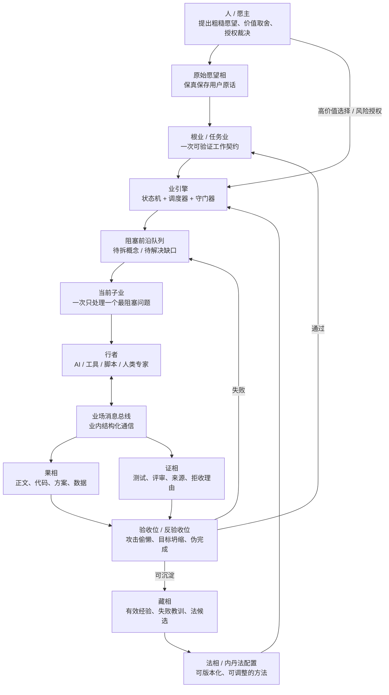
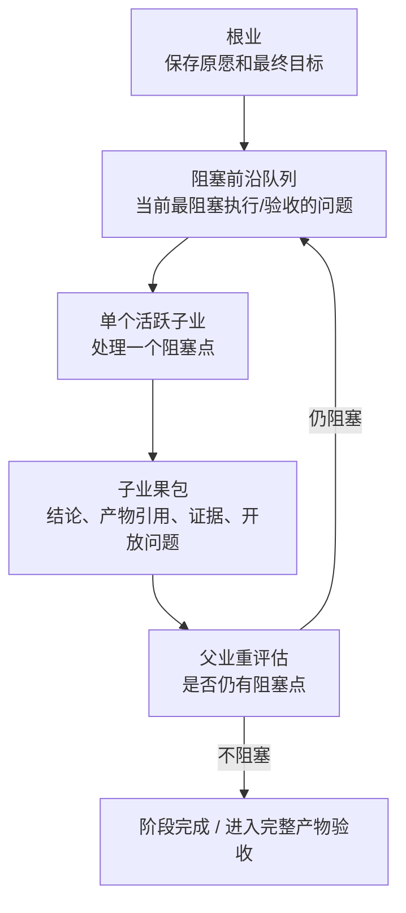
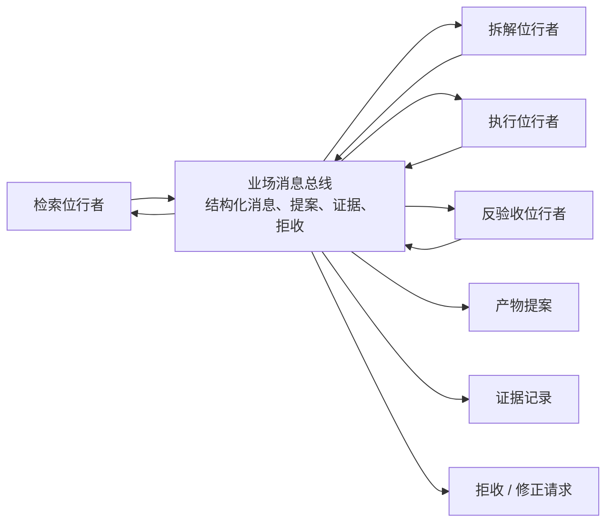

# 临时讨论：相业架构业引擎图文说明

> 状态：临时讨论稿，不是真相源。
> 用途：把当前关于相业架构、内丹法、业引擎、子业拆解、业内通信、验收回流的讨论整理成可画图、可继续推敲的架构草案。

## 1. 总体判断

当前讨论形成的基本判断是：

```text
相业架构负责语义和状态边界。
业引擎负责调度、分业、验收、回流和审计。
内丹法是可配置的法相，不是固定 prompt。
行者负责执行，不拥有系统真相。
果必须携证，验收失败必须回流。
```

这套设计的目标不是做一个更复杂的 workflow，也不是让 agent 自由递归，而是让低能力起点的用户能把粗糙愿望推进为可检查、可迭代、可交付的现实成果。

## 2. 总体结构图



## 3. 核心对象说明

| 对象 | 作用 | 关键边界 |
|---|---|---|
| 人 / 愿主 | 提供愿望、价值判断、授权和最终裁决 | 不被 AI 改写为系统目标 |
| 相 | 一切可保存、可引用、可版本化的稳定对象 | 文件只是存储后端，不是通信协议 |
| 业 | 一次有因、愿、律、法、行者、果、证的工作契约 | 不是 agent 会话，也不是固定流程节点 |
| 法 | 可配置方法，例如内丹法 | 不直接拥有状态迁移权 |
| 行者 | AI、工具、脚本、人类专家，承接业执行 | 不能自称完成，不能自由扩张任务树 |
| 果 | 产物，如正文、代码、方案、数据 | 果不等于完成，必须接受验收 |
| 证 | 为什么相信果成立或不成立 | 证也可被评审，不等于漂亮解释 |
| 藏 | 被验证后可复用的经验、失败教训、法候选 | 必须有来源、版本、范围和过期条件 |
| 业引擎 | 控制状态、分业、验收、回退和审计 | 不是超级 agent，不替代语义判断 |

## 4. 内丹法的位置

内丹法不应继续主要依赖 skill 文本自觉执行，而应成为一个可配置、可校验、可版本化的法相。

内丹法配置应描述：

```text
如何保存原愿。
如何扫描已有法和材料。
如何识别阻塞概念。
如何递归下钻到动作、信号、失败信号、边界和反馈源。
如何生成原子动作。
如何要求完整产物。
如何验收。
如何在失败时回流或回退。
```

代码不应写死“怎么写小说”“怎么做软件”“怎么研究市场”，但必须写死元规则：

```text
不能目标坍缩。
不能概要冒充产物。
不能验收失败后结束。
不能 AI 自称通过。
不能无证沉淀长期经验。
不能让行者自由扩张任务树。
```

## 5. 多层拆解模型

内丹法需要多层级拆解，但多层级不等于多层 agent 递归。

推荐模型是：

```text
语义上：多层业网。
执行上：先用两层循环 + 阻塞前沿队列。
```



这与完整父子孙业树在很多单分支场景中近似等价，但不完全等价：

| 模型 | 优点 | 风险 |
|---|---|---|
| 父子孙业树 | 上下文隔离更清楚，能保留多分支关系 | 引擎更复杂，分支管理成本高 |
| 两层循环 | 实现简单，状态更可控 | 若前沿队列设计不好，父业上下文会膨胀 |

当前建议先做最小版本：

```text
根业 + 阻塞前沿队列 + 单活跃子业 + 结构化回流包。
```

后续如果出现多分支并行、交叉依赖、长期分支保留，再升级为完整业网调度。

## 6. 分业机制

分业不应由行者自由决定，而应采用：

```text
AI 提议，代码守门，业引擎登记。
```

AI 可以提出分业申请：

```yaml
split_request:
  parent_ye_id: ye_001
  concept: 爆款
  reason: 阻塞小说产物验收
  proposed_child:
    objective: 拆解“爆款”到追读、点击、复述、分享等代理指标
    expected_output: 爆款代理指标表
    acceptance:
      - 有可观察信号
      - 有失败信号
      - 有文本动作
      - 有反馈来源
  risk_if_not_split: 后续产物只能用模糊“好看”验收
```

代码审核：

```text
是否阻塞父业执行。
是否阻塞父业验收。
是否能产出独立果。
是否有明确验收标准。
是否和已有子业重复。
是否超过深度、时间、成本预算。
是否可以直接复用已有法或藏。
是否只是装饰性概念拆分。
```

必须分业的情况：

```text
阻塞执行或验收。
需要外部检索、实验、代码运行、真实反馈。
需要不同位的行者。
产物足够大，继续放在父业会污染上下文。
验收失败原因指向一个可隔离问题。
```

禁止分业的情况：

```text
只是为了概念完整性。
没有独立产物。
没有验收标准。
结果无法被父业消费。
已有法或已有藏可以直接解决。
```

## 7. 业内多行者通信

业内部多个行者可以通信，但不能自由群聊改状态。



业内通信的规则：

```text
业内用消息总线协作。
业间用果包交接。
状态迁移只由业引擎执行。
自由对话不能直接改变业状态。
```

消息应是结构化事件，例如：

```yaml
msg_id: msg_001
ye_id: ye_neidan_001
from:
  xingzhe_id: researcher_1
  wei: 检索位
to:
  wei: 拆解位
type: evidence_ready
intent: 提供证据
payload:
  summary: 找到 3 类网文黄金三章结构
artifact_refs:
  - art_ref_123
evidence_refs:
  - ev_456
requires_response: false
visibility: ye_internal
ttl: current_round
```

## 8. 业间通信

业之间不应直接传文件，也不应共享一个大文件。业间传递的是结构化果包：

```yaml
ye_id: ye_001
status: accepted
outputs:
  - artifact_id: art_novel_ch1_v3
    type: text.chapter
    version: 3
    uri: artifacts/art_novel_ch1_v3.md
    hash: sha256:...
claims:
  - claim_id: c1
    text: 第一章已完成完整正文
    evidence_refs: [ev_001, ev_002]
context_return:
  summary: 本业完成第一章正文，但缺真实读者反馈。
  key_decisions:
    - 使用“第七孵化所”作为书名
  open_questions:
    - 是否继续写完整黄金三章
```

文件可以作为相的存储后端，但不应成为通信协议。下游业读取的是 artifact 引用、版本、hash、摘要、声明、证据和开放问题。

## 9. 验收与失败回流

验收不是结尾说明，而是控制信号。

核心规则：

```text
核心验收不通过，不得结束。
完整产物不完整，不得通过。
代码没运行，不能说软件可用。
章节没正文，不能说黄金三章完成。
AI 自评不能冒充外部反馈。
```

失败后必须进入一种状态：

```text
修正：当前产物可修，生成修正业。
回退：当前路径错误，回到上一个有效检查点。
补证：产物可能成立，但缺测试、来源、读者反馈或运行证据。
仲裁：涉及价值选择、风险授权或高分歧，需要人类裁决。
废弃：该法、该产物或该路径被证据否定。
```

## 10. 业引擎最小实现

第一版不要做完整复杂图引擎。建议最小组件如下：

```text
YeStore：保存业契约和状态。
ArtifactStore：保存果和证的引用。
FrontierQueue：保存当前阻塞前沿。
SplitGate：审核 AI 分业申请。
Scheduler：调度当前活跃子业。
Validator：检查产物、证据和失败项。
AuditLog：只追加记录关键事件。
ContextPacker：给行者组装最小必要上下文。
```

最小运行过程：

```text
原愿进入
  -> 立根业
  -> 加载内丹法配置
  -> 生成阻塞前沿队列
  -> 激活一个子业
  -> 行者执行
  -> 子业返回果包
  -> 验收位检查
  -> 父业重评估
  -> 继续拆解 / 生成完整产物 / 回退 / 仲裁
```

## 11. 当前仍未解决的问题

这些问题不能用概念直接跳过，后续要用实验回答：

```text
阻塞前沿队列如何排序，防止 AI 只挑容易项。
分业深度和预算如何限制。
父业如何避免积累过长上下文。
哪些消息应升级为相，哪些只留在业内消息录。
验收位如何避免和执行位互相顺从。
法如何从一次失败中修正，而不是过度拟合。
什么时候两层循环不够，需要升级完整业网。
```

## 12. 当前结论

当前最稳妥的实现路线是：

```text
先做相业语义上的最小业引擎。
用两层循环执行多层拆解。
用结构化果包避免文件地狱。
用业内消息总线避免自由群聊。
用验收失败回流避免 AI 自称完成。
等单活跃子业模型跑通，再升级复杂业网。
```

最短表达：

> 相业架构负责语义，业引擎负责控制，内丹法负责方法，行者负责执行，证据负责纠偏。
