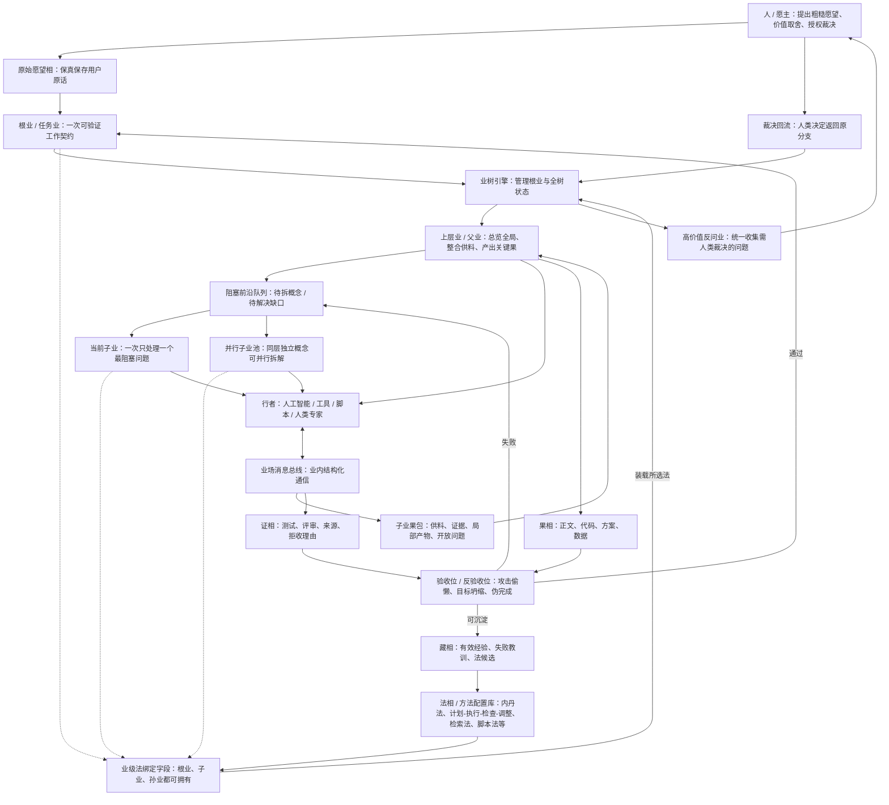
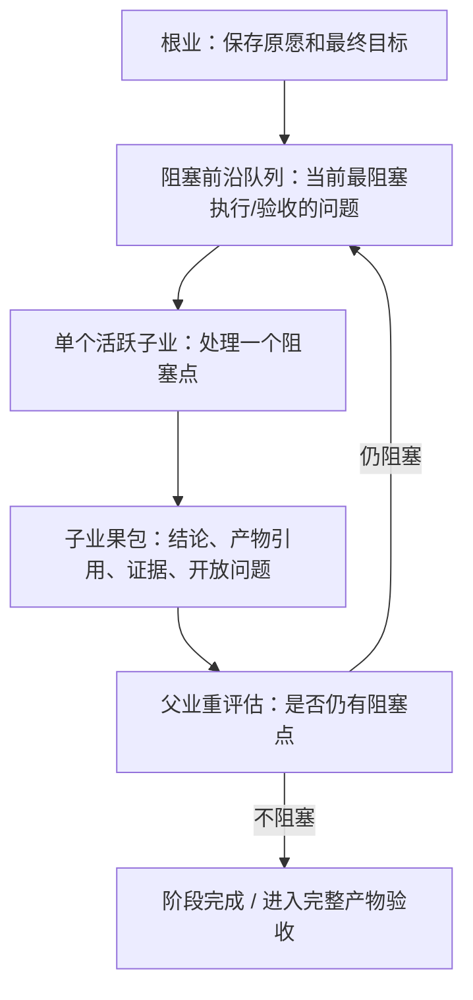
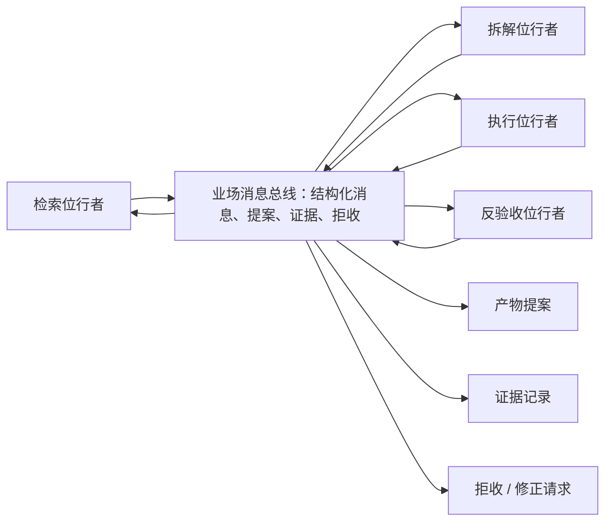

# 临时讨论：相业架构业引擎图文说明

> 状态：临时讨论稿，不是真相源。
> 用途：把当前关于相业架构、内丹法、业引擎、子业拆解、业内通信、验收回流的讨论整理成可画图、可继续推敲的架构草案。

## 1. 总体判断

当前讨论形成的基本判断是：

```纯文本
相业架构负责语义和状态边界。
业引擎负责调度、分业、验收、回流和审计。
业引擎只负责基础机制，不内化具体法。
每一个业理论上都可以选择自己的法，也可以不选；根业只负责初始化法、默认继承策略和高层约束。
复杂任务中，不同业可以调用不同法，例如概念拆解用内丹法，资料检索用检索法，本地脚本执行用脚本法，过程管理用 计划-执行-检查-调整。
内丹法等具体法都是可配置的法相，不是固定 提示词。
行者负责执行，不拥有系统真相。
果必须携证，验收失败必须回流。
高价值分支必须能够被统一收集、统一反问人类愿主，并把裁决回流到原分支。
业树引擎必须把根业也纳入管理，因为根业是整棵树的锚点、默认法来源和最终汇聚点。
需要全局一致性的核心产物不能随意下放给深层子业；上层业负责全局整合、关键产物和完成声明，子业负责供料、验证、局部确定性工作，或在清晰接口内执行局部产物。
```

这套设计的目标不是做一个更复杂的 流程编排，也不是让 代理 自由递归，而是让低能力起点的用户能把粗糙愿望推进为可检查、可迭代、可交付的现实成果。

### 1.1 三权分立与五条根律

当前更底层的判断是：人工智能支架 的核心危险不是“任务拆得不够细”，而是同一个行者同时拿走三种权力。

```纯文本
定义目标的权力。
改变状态的权力。
宣告完成的权力。
```

相业架构要成立，首先必须拆开这三种权力：

| 权力 | 危险形态 | 相业中的约束方向 |
|---|---|---|
| 定义目标的权力 | 人工智能 把人的粗糙愿望改写成自己的目标 | 愿主保留价值源头；高价值分支回到人类或明确授权 |
| 改变状态的权力 | 行者在聊天或局部执行中直接污染相 | 无业不改相；行者只能提交候选变化 |
| 宣告完成的权力 | 局部通过冒充全局完成，人工智能 自称交付 | 完成权归属于责任范围对应的上层业，果必须携证并验收 |

基于三权分立，当前更稳的五条根律是：

```纯文本
1. 愿源保真律。
2. 立业变更律。
3. 候选隔离律。
4. 缘备显缺律。
5. 证成归属律。
```

这五条仍应接受删律压测，但它们比上一版候选更接近根律：它们不绑定具体模块、流程、供给业、上下文包或某一种法。

#### 1.1.1 愿源保真律

> 人是愿、价值、授权和责任的源头；人工智能 只能提出候选解释、候选目标、候选取舍，不能替人改写高价值愿望。

保护的是定义目标的权力。

它要求：

```纯文本
原始愿望必须保真保存。
人工智能 对愿望的解释只是候选解释。
高价值分支必须回到人，除非已有明确代理授权。
授权边界必须显式记录。
```

删除后的失败：人工智能 会把用户的模糊愿望、审美、风险承受和价值选择改写成更容易执行的目标。

#### 1.1.2 立业变更律

> 一切稳定相的变化，都必须通过业发生；无业不改相。

保护的是改变状态的入口。

它要求：

```纯文本
聊天中的判断不能直接改当前真相。
行者记忆不能直接污染长期相。
工具输出不能直接成为当前事实。
文件、藏、证、法、律、果的变更都必须有业。
```

删除后的失败：系统退化成普通 代理，上下文、记忆、文件和状态混成一团。

#### 1.1.3 候选隔离律

> 行者、法、工具、子业只能提交候选变化；候选果、候选证、候选分业、候选法更新都不能自动成为真相。

保护的是执行者不能同时拥有状态变更权。

它要求：

```纯文本
行者输出 = 候选。
子业输出 = 候选。
法更新 = 候选。
验收报告 = 候选证。
候选变化必须被对应责任范围的业接收，才进入稳定相。
```

删除后的失败：即使有业，业内部的行者也能把自己的输出直接写成真相，绕过验收和合并。

#### 1.1.4 缘备显缺律

> 业执行前必须显式声明并满足必要缘；缘不足时，必须显式暴露缺口，不得靠幻觉、隐式上下文或大上下文强塞继续执行。

保护的是执行依据的完整性。

这里的“缺材料就立供给业”只是常见实现，不是根律本身。缘不足时可以有多种处理：

```纯文本
建立供给业。
检索相。
请求人类补充。
调用其他法。
降级目标。
拒绝执行。
```

删除后的失败：长篇小说、大工程代码、复杂研究会在缺人物状态、接口契约、世界规则、测试入口、事实来源时继续生成，看似完成，实际全局错乱。

#### 1.1.5 证成归属律

> 果必须携证；完成声明属于责任范围对应的业，局部业不能宣告上层业完成。

保护的是宣告完成的权力。

它要求：

```纯文本
果不等于完成。
证不等于真理，但没有证不能通过。
子业只能完成自己的局部契约。
父业负责父业范围内的完成。
根业负责最终完成。
```

删除后的失败：局部产物漂亮，但整体目标没达成；人工智能 或子业用局部通过冒充全局完成。

#### 五条根律之间的关系

| 根律 | 主要防守对象 |
|---|---|
| 愿源保真律 | 目标被偷换 |
| 立业变更律 | 状态被乱改 |
| 候选隔离律 | 执行者直接占有真相 |
| 缘备显缺律 | 缺材料硬执行和上下文幻觉 |
| 证成归属律 | 局部冒充全局完成 |

对应三权分立：

| 权力 | 根律 |
|---|---|
| 定义目标的权力 | 愿源保真律 |
| 改变状态的权力 | 立业变更律 + 候选隔离律 |
| 宣告完成的权力 | 证成归属律 |
| 执行依据的可靠性 | 缘备显缺律 |

#### 不是根律的东西

这些很重要，但不应放在根律层：

```纯文本
两层循环。
父子孙业树。
计划-执行-检查-调整。
内丹法。
供给业。
上下文打包器。
全局合并门。
前沿队列。
```

它们都是实现策略、运行律、方法或模块。
例如“缺材料就立供给业”是由“缘备显缺律”推出的一种动作，不是根律本身。

#### 删律验证

后续验证不应靠概念认同，而应做删律压测：

```纯文本
选择代表性复杂任务。
每次删除一条根律。
运行同一任务推演。
观察是否出现目标偷换、状态污染、候选冒充真相、缺缘伪执行、局部冒充全局、人类价值权丢失。
若失败无法被其他根律阻止，该根律通过必要性验证。
若失败能被其他根律阻止，该规则降级为运行律或方法建议。
```

代表性压测场景：

| 场景 | 主要验证点 |
|---|---|
| 长篇小说章节写作 | 子业是否局部正确但破坏人物、伏笔、世界规则 |
| 大工程代码重构 | 局部模块是否破坏接口、调用方、测试和架构边界 |
| 模糊愿望到产物 | 人工智能 是否偷换目标或缩小交付 |
| 高风险发布/删除/花钱 | 高价值分支是否被模型私自代理 |
| 多法嵌套执行 | 法调用是否绕过业、证和完成权 |

当前临时结论：

```纯文本
三权分立是更底层的架构锚点。
五条根律当前比上一版候选更稳定，但仍需删律压测。
根律不应绑定具体模块、流程、法或供给方式。
```

## 2. 总体结构图



## 3. 核心对象说明

| 对象 | 作用 | 关键边界 |
|---|---|---|
| 人 / 愿主 | 提供愿望、价值判断、授权和最终裁决 | 不被 人工智能 改写为系统目标 |
| 相 | 一切可保存、可引用、可版本化的稳定对象 | 运行库和果库只是存储后端，不是通信协议 |
| 业 | 一次有因、愿、律、法、行者、果、证的工作契约 | 不是 代理 会话，也不是固定流程节点 |
| 法 | 可配置方法，例如内丹法 | 不直接拥有状态迁移权 |
| 行者 | 人工智能、工具、脚本、人类专家，承接业执行 | 不能自称完成，不能自由扩张任务树 |
| 果 | 产物，如正文、代码、方案、数据 | 果不等于完成，必须接受验收 |
| 证 | 为什么相信果成立或不成立 | 证也可被评审，不等于漂亮解释 |
| 藏 | 被验证后可复用的经验、失败教训、法候选 | 必须有来源、版本、范围和过期条件 |
| 业引擎 / 业树引擎 | 控制根业与整棵业树的状态、分业、验收、回退和审计，只提供基础机制 | 不是超级 代理，不替代语义判断，不内化具体法 |
| 高价值反问业 | 汇总需人类裁决的高价值分支问题并回流决策 | 不能被单个行者私自吞掉 |

### 3.1 单个业节点的最小契约

单个业节点不是“任务标题加一点状态”，而是一份最小契约。
它至少应分成六组：

| 契约面 | 必须包含 | 方向 |
|---|---|---|
| 意图契约 | `原愿引用`、`目标`、`非目标`、`成功标准` | 上浮 + 下沉 |
| 边界契约 | `范围`、`允许方法`、`禁止动作`、`风险等级`、`预算` | 下沉为主 |
| 执行契约 | `法绑定`、`必要条件`、`输入引用`、`输出_结构定义` | 下沉 |
| 验收契约 | `验收标尺`、`证据要求`、`完成权` | 下沉 + 上浮结果 |
| 回流契约 | `开放缺口`、`阻塞类型`、`回退策略`、`人类升级` | 上浮 |
| 证据契约 | `果引用`、`证引用`、`源引用`、`裁决引用` | 只留引用 |

必须上浮的是会影响父业决策的内容：

```纯文本
目标是否变了。
还缺什么缘。
是否需要拆子业。
是否要问人。
风险是否升高。
能否完成、为何不能完成。
```

必须下沉的是本层执行真正需要的内容：

```纯文本
本层目标快照。
方法细节。
验收规约。
预算切片。
允许/禁止动作。
回退路径。
必要条件。
```

只能留作引用的内容：

```纯文本
原始材料全文。
搜索结果全文。
代码 差异 全文。
日志全文。
产物全文。
历史会话全文。
```

验收位的最低要求不是“几个 人工智能”，而是“几个独立角色”：

```纯文本
最低：2 个独立角色，执行位 + 验收位。
更稳：3 个角色，执行位 + 独立验证位 + 责任签收位。
高价值/不可逆：再加人类裁决位。
```

验收者不必须是 人工智能，但必须独立于产出者；它可以是规则引擎、测试脚本、静态检查器、人类或独立 人工智能 会话。
关键不是“是不是 人工智能”，而是**不能让产出者自己验收自己**。

## 4. 法的位置与内丹法示例

任何法都不应继续主要依赖 法 文本自觉执行，而应成为可配置、可校验、可版本化的法相。
内丹法只是当前重点讨论的示例法之一，不是业树引擎内置中心法。

以内丹法为例，它的配置应描述：

```纯文本
如何保存原愿。
如何扫描已有法和材料。
如何识别阻塞概念。
如何递归下钻到动作、信号、失败信号、边界和反馈源。
如何生成原子动作。
如何要求完整产物。
如何验收。
如何在失败时回流或回退。
```

根业在立业时要先给出默认法与继承规则，再让业树引擎按业级法绑定契约去调度。  
但每个子业、孙业都可以在自己的契约里重新选择法、继承法或不选法。  
业树引擎不需要知道“内丹法怎么拆小说”或“计划-执行-检查-调整 怎么做组织迭代”，它只需要知道如何装载法、记录状态、校验产物、触发回流。
同时，业树引擎不能把根业当成纯外部标签，它必须管理根业的生命周期、状态、默认法、失败回流和最终汇聚，因为树上所有分支都从根业派生并最终回到根业判断。

多种法可以嵌套使用，而且**任意法都应支持被其他法嵌套，也应支持再嵌套回其他法**。
这里的 计划-执行-检查-调整、内丹法、总结法都只是例子，不是特权法，也不是唯一的法层级。
真正需要的是一个统一的“法调用帧”机制，让任意法都可以像函数一样被调用、返回、再调用。

嵌套关系应由根业和方法配置显式声明。例如：

```纯文本
计划-执行-检查-调整(外层循环)
  计划步: 调用内丹法做概念拆解和计划生成
  执行步: 调用执行法或领域法产出真实果
  检查步: 调用评审法/验证法检查产物
  调整步: 调用总结法/压缩法把有效方法沉淀为 法 或新法候选
```

上面的例子不是说 计划-执行-检查-调整 只能包内丹法。实际规则应该是：

```纯文本
任意法甲可以调用法乙。
法乙在自己的执行中也可以再调用法丙。
法丙甚至可以在受控条件下再次调用法甲。
```

因此会出现你说的这种情况：

```纯文本
计划-执行-检查-调整 -> 内丹法 -> 计划-执行-检查-调整 -> 内丹法 -> ...
```

它在语义上是允许的，但必须受三个约束：

1. 每次调用都要形成明确的法调用帧。
2. 每层都要有自己的输入、输出、验收和回流点。
3. 必须有预算、深度或重复检测，防止无限互相嵌套。

所以，内丹法只是计划阶段可调用的子法之一，而不是把所有外层循环都吞进去；反过来，内丹法内部也可以再调用 计划-执行-检查-调整、总结法或其他法，只要该调用确实改善计划、执行、验收或沉淀。

### 4.1 法绑定是业级别的，不是根业垄断

每个业都应有自己的法绑定字段，例如：

```键值
业编号: 业_001_002
法绑定:
  模式: 继承 | 覆盖 | 不绑定
  所选法集:
    - 内丹法.第一版
    - 网页检索法.第一版
  原因: 本业同时需要概念拆解和外部资料检索
  回退策略:
    - 使用父法
    - 使用默认法
```

含义如下：

| 模式 | 含义 |
|---|---|
| 继承 | 默认继承父业方法 |
| 覆盖 | 本业显式覆盖父业方法 |
| 不绑定 | 本业不绑定具体法，只使用业引擎默认基础规则 |

这样，复杂任务里可以出现：

```纯文本
根业：计划-执行-检查-调整
  子业甲：内丹法做概念拆解
  子业乙：检索法查外部资料
  子业丙：脚本法写并跑本地脚本
  子业丁：总结法压缩为新 法
```

根业不需要垄断法选择，只需要提供默认法和继承策略，避免方法混乱。

代码不应写死“怎么写小说”“怎么做软件”“怎么研究市场”，但必须写死元规则：

```纯文本
不能目标坍缩。
不能概要冒充产物。
不能验收失败后结束。
不能 人工智能 自称通过。
不能无证沉淀长期经验。
不能让行者自由扩张任务树。
```

## 5. 多层拆解模型

内丹法需要多层级拆解，但多层级不等于多层 代理 递归。

推荐模型是：

```纯文本
语义上：多层业网。
执行上：先用两层循环 + 阻塞前沿队列。
深挖时一个子业默认只处理一个阻塞问题。
同层独立概念可以拆成多个子业并行跑，但必须先定方法和计划。
```



这与完整父子孙业树在很多单分支场景中近似等价，但不完全等价：

| 模型 | 优点 | 风险 |
|---|---|---|
| 父子孙业树 | 上下文隔离更清楚，能保留多分支关系 | 引擎更复杂，分支管理成本高 |
| 两层循环 | 实现简单，状态更可控 | 若前沿队列设计不好，父业上下文会膨胀 |

当前实现先做最小版本：

```纯文本
根业 + 业级法绑定 + 上层全局业 + 阻塞前沿队列 + 单活跃深挖子业 + 可选并行同层子业池 + 结构化回流包。
```

后续如果出现多分支并行、交叉依赖、长期分支保留，再升级为完整业网调度。

### 5.1 全局产物与子业边界

分业的目标是降噪和获得材料，不是把需要全局一致性的工作切碎到失去方向。

更准确的规则是：

```纯文本
子业不能拥有全局完成声明。
需要全局一致性的核心产物，默认由上层业负责最终整合和定稿。
子业可以供料、验证、局部加工，也可以在接口清晰时完成局部产物。
父业或上层业负责检查局部产物是否破坏全局一致性。
```

三类工作应区别处理：

| 工作类型 | 处理方式 | 示例 |
|---|---|---|
| 全局一致性强的核心产物 | 留在上层业执行或最终定稿 | 长篇主线、整卷章节、核心架构重构、全局产品方案 |
| 局部确定性工作 | 子业执行 | 检索资料、扫描调用方、整理人物状态、运行测试、抽取伏笔 |
| 接口清晰的局部创作或实现 | 可交给子业执行，但必须有接口契约和合并验收 | 写某个支线场景初稿、实现已定义接口模块、补一个明确测试 |

这避免两个极端：

```纯文本
过度下放：子业局部正确但全局迷失。
过度集中：父业重新变成超级 代理，所有工作都压在一个上下文里。
```

长篇小说中的合理形态：

```纯文本
上层写作业：负责第 17 章的全局目标、人物弧线、伏笔回收和正文定稿。
  子业甲：整理主角当前状态。
  子业乙：列出本章必须回应的伏笔。
  子业丙：检查世界规则限制。
  子业丁：生成可用冲突素材。
  子业戊：写一个接口清晰的局部场景初稿。
上层写作业：整合材料并完成最终章节正文。
```

大工程代码中的合理形态：

```纯文本
上层重构业：负责核心模块边界、最终 差异 和完成声明。
  子业甲：扫描调用方。
  子业乙：整理接口契约。
  子业丙：找测试入口。
  子业丁：识别风险边界。
  子业戊：实现一个已定义接口的小模块。
上层重构业：合并局部结果，运行全局验收。
```

最短规则：

> 上层业总览成事，子业供料证成；子业可以做局部产物，但不能宣告全局完成。

## 6. 分业机制

分业不应由行者自由决定，而应采用：

```纯文本
人工智能 提议，代码守门，业引擎登记。
```

当分支只影响局部执行效率时，模型可以代理判断是否继续拆。  
当分支触及高价值选择、不可逆操作、价值冲突、授权边界或长期后果时，必须进入高价值反问业，由业统一收集问题并回流人类愿主裁决。

人工智能 可以提出分业申请：

```键值
分业申请:
  父业编号: 业_001
  概念: 爆款
  原因: 阻塞小说产物验收
  拟议子业:
    目标: 拆解“爆款”到追读、点击、复述、分享等代理指标
    预期输出: 爆款代理指标表
    验收:
      - 有可观察信号
      - 有失败信号
      - 有文本动作
      - 有反馈来源
  不拆分风险: 后续产物只能用模糊“好看”验收
```

代码审核：

```纯文本
是否阻塞父业执行。
是否阻塞父业验收。
是否能产出独立果。
是否有明确验收标准。
是否和已有子业重复。
是否超过深度、时间、成本预算。
是否可以直接复用已有法或藏。
是否只是装饰性概念拆分。
```

必须分业的情况：

```纯文本
阻塞执行或验收。
需要外部检索、实验、代码运行、真实反馈。
需要不同位的行者。
产物足够大，继续放在父业会污染上下文。
验收失败原因指向一个可隔离问题。
全局业缺少某类材料、证据、局部实现或局部草稿，需要子业供给。
```

禁止分业的情况：

```纯文本
只是为了概念完整性。
没有独立产物。
没有验收标准。
结果无法被父业消费。
已有法或已有藏可以直接解决。
需要全局一致性的核心完成声明被下放给深层子业。
```

### 6.1 高价值反问与人类裁决回流

高价值反问不是随便打断，而是由业树引擎统一管理的高价值问题收集器。

典型触发条件：

| 条件 | 含义 | 默认动作 |
|---|---|---|
| 高价值选择 | 不同答案会导致不同长期走向、责任或资产结果 | 先拦截，进入高价值反问业 |
| 不可逆操作 | 回滚代价高、影响外部世界或难以恢复 | 强制上交人类裁决 |
| 价值冲突 | 审美、偏好、伦理、授权、责任发生冲突 | 不让模型单独代理决定 |
| 高风险授权 | 需要花钱、发布、删除、对外承诺、访问敏感资源 | 必须问人 |
| 语义不确定但后果大 | 模型也无法给出足够可信的代理判断 | 暂停并汇总问题 |

高价值反问业应输出一个统一的裁决包：

```键值
高价值问题编号: 高价值问题_001
源业编号: 业_001_003
为何升级: 该分支涉及不可逆选择和价值冲突
向人类提问:
  - 这个分支是否要继续推进
  - 是否允许高风险路径
  - 是否需要拦截并改走保守方案
模型代理意见:
  允许: 否
  原因: 超出代理决策阈值
决策状态:
  待定 | 已批准 | 已拒收 | 已修改
回流路径: 原分支
```

人类裁决后必须回流到原分支，不能只停留在“问过人了”。

### 6.2 大模型是否可以代理决策判断

可以，但只限于低价值、低风险、可逆、边界清晰的分支。

建议分层：

| 分支类型 | 模型可否代理 | 说明 |
|---|---|---|
| 低价值、低风险、可逆 | 可以 | 可在策略阈值内代理 |
| 语义清晰但需要局部效率判断 | 可以 | 例如是否继续拆一个不关键概念 |
| 高价值、不可逆、价值冲突 | 不可以 | 必须上交人类愿主 |
| 高风险授权 | 不可以 | 必须拦截 |

判断建议：

```纯文本
是否升级 =
  高价值
  或 不可逆
  或 价值冲突
  或 高风险
  或 代理置信度低 && 影响大
```

所以不是“模型能不能判断”，而是“模型能否在政策阈值内代理判断”。超阈值就必须反问人类。

## 7. 业内多行者通信

业内部多个行者可以通信，但不能自由群聊改状态。



业内通信的规则：

```纯文本
业内用消息总线协作。
业间用果包交接。
状态迁移只由业引擎执行。
自由对话不能直接改变业状态。
```

消息应是结构化事件，例如：

```键值
消息编号: 消息_001
业编号: 业_内丹_001
来源:
  行者编号: 检索行者_1
  位: 检索位
去向:
  位: 拆解位
类型: 证据就绪
意图: 提供证据
载荷:
  摘要: 找到 3 类网文黄金三章结构
果引用:
  - 果引用_123
证引用:
  - 证引用_456
需要回应: 否
可见性: 业内
有效期: 本轮
```

### 7.1 父业、子业与兄弟引用边界

父业掌握的是本树的控制面，不是每个子业的全文工作集。

父业应保留：

```纯文本
本树目标摘要。
验收口径。
开放缺口。
共享引用目录。
子业注册表。
回流与仲裁权。
```

子业应保留：

```纯文本
本层 目标 快照。
输入 引用。
法绑定。
必要条件。
本地验收。
回退策略。
果/证据 引用。
```

兄弟共享引用只允许共享父业登记过的版本化引用，不允许直接共享可变状态。
共享的是 `引用 + 摘要 + 校验码 + 范围`，不是全文工作区。

```纯文本
共享引用默认必须是 已接收 / 已晋升 状态。
候选引用默认留在本业。
任何跨兄弟的稳定依赖都应经过父业登记。
```

如果两个兄弟反复需要彼此的未定稿，那通常不是“共享机制不够”，而是切分错了。
更合理的做法是：

```纯文本
合并成同一子业。
或插入一个整合子业。
或把共同依赖上收给父业生成共享参考。
```

拒绝规则：

```纯文本
不能直接读写兄弟 私有状态。
不能用共享引用替代本层验收。
不能用兄弟共享结果宣布全树完成。
不能把兄弟间强耦合伪装成自然并行。
```

## 8. 业间通信

业之间不应直接传文件，也不应共享一个大文件。业间传递的是结构化果包：

```键值
业编号: 业_001
状态: 已接收
输出项:
  - 果编号: 小说第一章_第3版
    类型: 正文章节
    版本: 3
    位置: 果库/小说第一章_第3版.文档
    校验码: 校验码256:...
主张:
  - 主张编号: 主张_1
    内容: 第一章已完成完整正文
    证引用: [证据_001, 证据_002]
上下文回流:
  摘要: 本业完成第一章正文，但缺真实读者反馈。
  关键裁决项:
    - 使用“第七孵化所”作为书名
  开放问题项:
    - 是否继续写完整黄金三章
```

文件可以作为相的存储后端，但不应成为通信协议。下游业读取的是 果 引用、版本、校验码、摘要、声明、证据和开放问题。

如果该果包来自子业，还必须说明它是：

```纯文本
供料。
验证结果。
局部确定性产物。
接口清晰的局部创作或实现。
```

子业果包不能写成“全局完成”，除非它本身就是根业或被上层业显式授权为最终合并业。

## 9. 验收与失败回流

验收不是结尾说明，而是控制信号。

核心规则：

```纯文本
核心验收不通过，不得结束。
完整产物不完整，不得通过。
代码没运行，不能说软件可用。
章节没正文，不能说黄金三章完成。
人工智能 自评不能冒充外部反馈。
```

失败后必须进入一种状态：

```纯文本
修正：当前产物可修，生成修正业。
回退：当前路径错误，回到上一个有效检查点。
补证：产物可能成立，但缺测试、来源、读者反馈或运行证据。
仲裁：涉及价值选择、风险授权或高分歧，需要人类裁决。
废弃：该法、该产物或该路径被证据否定。
```

## 10. 业引擎最小实现

第一版不要做完整复杂图引擎，也不要先堆模块名。更稳妥的做法是：先把五条根律落实为代码中不可绕过的状态约束，再把模块当成这些约束的派生实现。

### 10.1 从根律到代码约束

| 根律 | 第一版必须写死的代码约束 | 可以后置的实现 |
|---|---|---|
| 愿源保真律 | 每个根业必须保存原始愿望 `原愿`、候选解释 `候选解释`、授权边界 `授权策略`；高价值裁决必须有人工决策事件或明确代理授权 | 高级偏好学习、长期用户画像、复杂价值模型 |
| 立业变更律 | 所有稳定状态变更都必须通过 `业编号 + 事件` 进入事件账本；禁止行者、工具、法直接改稳定相 | 服务端数据库、分布式事务、完整权限系统 |
| 候选隔离律 | 行者、工具、子业、法只能提交 `候选*`；只有责任业接受后才能进入稳定相 | 多级审批 界面、复杂合并策略 |
| 缘备显缺律 | 业执行前必须跑 `预检`，声明 `必要条件`、`可用引用`、`缺口`；存在阻塞缺口时只能进入补缘、反问、降级、拒绝或等待 | 智能检索、自动供给业、上下文优化器 |
| 证成归属律 | 果必须带 `证引用`；只有范围负责人业能声明本范围完成；子业完成不能自动推出父业完成 | 人工智能 评审团、外部反馈系统、复杂质量分模型 |

这意味着第一版真正需要的是一个很小的内核：

```纯文本
事件账本：只追加记录所有状态迁移。
业状态机：根据事件计算当前业状态。
候选区：保存未被责任业接受的果、证、分业申请、法更新。
相引用库：保存果、证、法、上下文引用的版本和 校验码。
守门器：在状态迁移前检查五条根律。
```

其他名字，例如 前沿队列、法绑定器、高价值问题队列、校验器、全局合并门，都先不要当成独立大系统。第一版只是守门器和状态机里的几个函数。等函数职责稳定、重复出现，再提升为模块。

### 10.2 最小数据模型

第一版采用单一运行库作为核心存储后端。文件只承担大对象、附件和导出快照，不承担业间通信，也不承担运行态真相。业之间只传结构化引用，不传“某个大文件第几行”。

```纯文本
业实例表
  业编号
  父业编号
  根业编号
  状态
  范围
  目标
  原愿引用
  责任范围
  法绑定
  必要条件
  验收
  上下文引用
  候选引用
  证引用
  果引用
  开放缺口
  人类问题

事件表
  事件编号
  业编号
  类型
  行者编号
  载荷
  创建时间
  前一校验码
  校验码

候选表
  候选编号
  业编号
  种类: 果 | 证据 | 分业申请 | 法补丁 | 完成声称
  载荷引用
  证引用
  状态: 待定 | 已接收 | 已拒收 | 已取代

果引用表 / 证引用表
  编号
  类型
  位置
  版本
  校验码
  摘要
  产出业编号
```

本地原型目录固定为：

```纯文本
.金箍/运行态/
  金箍运行库.数据库
  果库/
    <果编号>/
      正文.*
      附件/
  导出/
    人类可读快照/
    人类可读报告/
```

`.金箍/运行态/` 是运行态，不应提交。可提交的是 结构定义、测试、样例输入、样例事件和可复现实验脚本。运行库保存核心真相，果库保存大对象，导出区保存人类阅读结果。

### 10.3 最小状态机

第一版状态只使用下面这些：

```纯文本
草稿：业已创建，但契约未齐。
就绪：契约和必要缘已声明，可进入执行。
运行中：行者正在执行。
阻塞中：缘不足，等待补缘、反问、检索、降级或拒绝。
评审中：已有候选果/证，等待责任业验收。
已接收：本业范围内通过。
已拒收：候选被拒收，需要修正、回退或废弃。
等待人裁：需要愿主裁决。
废弃：本业路径被废弃。
```

关键事件先控制在少数：

```纯文本
根业已创建
业已创建
法已绑定
预检已完成
缺口已声明
人类问题已提出
人类决策已返回
行者运行已开始
候选已提交
证据已提交
候选已接收
候选已拒收
分业申请
子业已开启
业已完成
业已重开
业已废弃
```

所有事件进入账本前都要经过守门器。例如：

```纯文本
没有 业编号 的事件拒绝。
修改稳定相但不是 接收候选 / 业完成 等合法事件的拒绝。
没有 证引用 的 完成声称 拒绝。
子业试图完成父业或根业的拒绝。
存在阻塞 缺口 却进入 运行中 的拒绝。
高价值问题没有 人类决策已返回 或代理授权却继续执行的拒绝。
```

### 10.4 逐步代码搭建路线

不要从“完整 人工智能支架”开始。第一阶段甚至不接大模型，先证明根律能被代码挡住。

```纯文本
第 0 步：运行库结构定义与事件账本
  只定义 业/事件/候选/果引用/证引用。
  写 追加事件、载入状态、回放事件。
  验证事件可重放、可追溯、不可无来源改状态。

第 1 步：单根业手动闭环
  命令行 创建根业，保存原始愿望。
  手动提交候选果和候选证。
  守门器拒绝无证完成、拒绝目标偷换、拒绝无业改相。
  目标是跑通“愿望 -> 候选 -> 验收 -> 完成/拒收”。

第 2 步：候选隔离与验收打回
  所有行者输出先进入 候选。
  候选被接收后才能写入果相/证相引用。
  候选已拒收 必须带拒收理由和下一步状态：修正、回退、补证、仲裁、废弃。
  目标是消灭“输出即完成”。

第 3 步：缘备显缺与补缘动作
  给 业 增加 必要条件、可用引用、缺口。
  预检 发现缺口后进入 阻塞中。
  阻塞中 只能转向补缘子业、人工反问、目标降级、拒绝执行或等待。
  目标是消灭“缺材料但硬做”。

第 4 步：两层循环分业
  先不做无限父子孙树。
  父业维护阻塞前沿；一次激活一个子业处理一个阻塞点。
  子业返回结构化果包，父业重评估是否继续拆。
  同层多个独立阻塞点可以并行，但必须先由父业登记计划和验收口径。
  目标是用简单机制获得多层拆解效果。

第 5 步：法绑定与法调用帧
  每个业可声明 继承/覆盖/不绑定。
  法以配置形式存在，输出结构化动作建议，不直接改状态。
  法调用必须形成法调用帧：输入、输出、预算、深度、验收、回流点。
  目标是让内丹法、计划-执行-检查-调整、总结法都能被调用，但没有任何法成为引擎内核。

第 6 步：高价值反问业
  增加 人类问题已提出 / 人类决策已返回。
  高价值、不可逆、价值冲突、高风险授权必须进入 等待人裁。
  人类决策必须回到原 业编号 和原分支。
  目标是让“问人”不是聊天插曲，而是可回流的状态迁移。

第 7 步：接入模型行者
  模型只能提交结构化 候选、分业申请、缺口报告、法建议。
  模型不能直接追加接收事件，不能直接声明业完成。
  模型选择来自配置文件，不写死在业务逻辑。
  目标是让 人工智能 努力工作，但不能拿走目标权、状态权、完成权。

第 8 步：真实验证器
  代码任务接入测试命令、静态检查、差异 检查。
  写作任务接入完整性检查、验收规约、人工反馈或发布反馈。
  研究任务接入来源引用和反证检查。
  目标是让证据从“人工智能 自评”升级为可复核证据。

第 9 步：并行子业与完整业网
  只有当两层循环在真实任务中证明不够，再升级。
  升级条件包括：长期并行分支、交叉依赖、多个上层汇聚点、需要保留分支历史。
  目标是避免一开始为想象中的复杂性付出引擎复杂度。
```

### 10.5 第一批代码实验

第一批实验不要追求产物漂亮，而要故意攻击根律：

```纯文本
实验甲：没有业，直接提交 果，必须失败。
实验乙：子业提交“全局完成”，必须失败。
实验丙：完成声称 没有 证引用，必须失败。
实验丁：预检 发现缺世界设定/接口契约/测试入口，仍进入 运行中，必须失败。
实验戊：高风险发布或删除没有人工授权，必须失败。
实验己：模型提交 分业申请，守门器只在满足阻塞、独立产物、验收标准、预算条件时放行。
实验庚：候选法更新没有经过验收，不能进入 法库。
```

这些实验比一开始做漂亮 界面 或复杂多 代理 更重要。它们回答的是：相业架构是否真的从代码层阻止了普通 代理 支架 的典型失败。

### 10.6 实现端实体与系统工作方式

实现端只保留下列实体。任何新增实现对象都必须能落入其中之一；落不进去的对象只算派生视图或临时变量，不算核心实体。

| 实体 | 对应相业概念 | 职责 | 生命周期 | 物理落点 |
|---|---|---|---|---|
| 原愿记录 | 因 / 愿 | 保存原始愿望、候选解释、授权边界，不被改写 | 创建、确认、重写、撤销、归档 | 运行库中的原愿记录表 |
| 业实例 | 业 | 承载一次工作契约、父子关系、状态机、验收、回流 | `草稿` -> `就绪` -> `运行中` -> `阻塞中` -> `评审中` -> `已接收/已拒收/等待人裁/废弃` | 运行库中的业实例表 |
| 事件账本 | 行 | 只追加记录所有状态迁移、分业、验收、回流、审计 | 只追加 | 运行库中的事件表 |
| 业状态快照 | 业态 | 保存当前可读状态，作为事件账本的派生缓存 | 读取、重放、刷新、废弃 | 运行库中的业状态快照表 |
| 相引用库 | 相 | 保存所有稳定对象的版本、校验码、范围、摘要 | 版本化只读 | 运行库中的相引用表 |
| 候选池 | 候选 | 保存行者和子业提交的未接收变化 | 待定 / 已接收 / 已拒收 / 已取代 | 运行库中的候选表 |
| 法目录 | 法 | 保存可调用法的配置、版本、适用边界 | 版本化 | 运行库中的法表 |
| 法调用帧 | 法调用 | 记录一次法调用的输入、输出、预算、深度、回流点 | 进入、运行、返回、废弃 | 运行库中的法调用帧表 |
| 行者实例 | 行者 | 承接业执行，提供模型、工具、脚本或人类接口 | 注册、承接、执行、评估、降权、禁用 | 运行库中的行者表 |
| 果相 | 果 | 保存产物、方案、代码、正文、数据、决策 | 生成、待验、通过、拒收、被取代、归档 | 运行库中的果表 + 果库目录 |
| 证相 | 证 | 保存验证依据、测试、评审、拒收理由 | 生成、绑定果、复核、失效、归档 | 运行库中的证表 |
| 律相 | 律 | 保存机器可执行边界规则 | 草拟、批准、启用、命中、修订、废止 | 运行库中的律表 |
| 位相 | 位 | 保存职责位置、验收权、拒收权、上报条件 | 创建、分配、承接、履责、交还、冻结 | 运行库中的位表 |
| 藏相 | 藏 | 保存经验证可复用的经验、失败教训、法候选 | 候选、批准、可检索、被引用、过期、清理 | 运行库中的藏表 |
| 镜相 | 镜 | 保存给人类看的进度、风险、决策点投影 | 生成、刷新、展开、收起、失效、重建 | 运行库中的镜表 |
| 信相 | 信 | 保存局部信用、置信度和适用范围 | 初始化、积累、上升、下降、冻结、重评 | 运行库中的信表 |
| 险相 | 险 | 保存风险来源、等级、累积值、缓解方式 | 发现、计量、累积、升级、缓解、关闭、复盘 | 运行库中的险表 |
| 反问相 | 反问 | 保存必须交还人类愿主裁决的问题 | 产生、汇总、等待、返回、关闭 | 运行库中的反问表 |
| 裁决相 | 裁决 | 保存人类决策与原分支回流结果 | 生成、回流、追踪、废弃 | 运行库中的裁决表 |
| 审计录 | 审计 | 保存谁在何时改了什么 | 只追加 | 运行库中的审计表 |

这 19 类实体已经覆盖了稳定对象、变化过程、局部候选、状态快照、方法调用、验收、回流、审计、风险、信用和人类裁决。任何额外对象如果不能落入其中之一，就不是核心实体，只能是派生视图或临时变量。

### 10.7 这些实体如何工作

1. 人类先写原愿记录。
2. 业树引擎创建业实例，并写入事件账本。
3. 业实例绑定法目录里的法，生成法调用帧。
4. 行者实例执行，所有输出先进入候选池。
5. 守门器检查候选是否可以升格为果相、证相或子业。
6. 高价值问题进入反问相，等待人类裁决。
7. 人类裁决写入裁决相，再回流到原业实例和原分支。
8. 业状态由事件账本重放得到，快照只是加速缓存。
9. 稳定对象只能通过相引用库被下游引用。
10. 藏相只接收已经验证可复用的经验。
11. 任何结果要宣告完成，都必须带证相和责任签收。
12. 运行库承担核心状态、事件、索引、事务和引用解析。
13. 果库只保存长文本、代码包、图片、附件等大对象。
14. 导出区只保存给人类阅读的快照和报告，不是真相源。
15. 业内通信先走内存消息，只有候选、证据、事件、裁决、风险升级等需要持久化的内容才进入运行库。

### 10.8 运行态承载二十轮攻击式验证

| 轮次 | 攻击点 | 修正后判断 | 结论 |
|---|---|---|---|
| 1 | 运行库本质上也是文件 | 它是受事务、索引和约束管理的单一运行库，不是无序小文件堆 | 接受运行库 |
| 2 | 小记录大量产生 | 业、候选、证、事件进入表，不再每条记录一个文件 | 避免小文件地狱 |
| 3 | 业间通信如果都写库会慢 | 通信走内存消息，只有状态迁移和可复盘内容落库 | 不把数据库当聊天总线 |
| 4 | 中间推理是否保存 | 默认不保存，只保存影响状态、证据、裁决、回退和沉淀的内容 | 防止数据库版上下文地狱 |
| 5 | 事件账本放库里是否仍只追加 | 事件表只允许追加，禁止普通更新和删除路径 | 保留账本语义 |
| 6 | 快照和事件可能不一致 | 事件追加和快照更新必须在同一事务内完成 | 保证状态一致 |
| 7 | 多业并行写冲突 | 第一版由业树引擎串行化关键写入，短事务排队 | 避免手写锁文件 |
| 8 | 读写速度是否够 | 运行库用页、索引和缓存管理小记录，比大量打开小文件更稳定 | 性能方向正确 |
| 9 | 大文本和代码包会撑爆库 | 大果进入果库，运行库只存引用、校验码、摘要和状态 | 避免运行库膨胀 |
| 10 | 果库会不会变成新文件地狱 | 果库只存大对象，不存碎片状态；小状态仍在运行库 | 控制文件数量 |
| 11 | 人类可读性下降 | 人类读镜相视图和导出报告，不直接翻运行库 | 可读性由导出层承担 |
| 12 | 数据迁移困难 | 运行库必须有结构版本表、迁移记录和迁移脚本 | 迁移可治理 |
| 13 | 契约版本如何管理 | 表结构、事件类型、引用结构都必须带版本语义 | 防止隐式破坏兼容 |
| 14 | 人工智能如何引用材料 | 只传引用编号、类型、版本、校验码、摘要和范围 | 不传文件行号 |
| 15 | 运行库损坏怎么办 | 必须提供备份、校验、导出和事件重放测试 | 恢复路径明确 |
| 16 | 数据库黑箱问题 | 必须提供查询视图、审计导出、事件回放器和结构说明 | 可审计 |
| 17 | 高并发不够 | 第一版面向本地单用户和低并发；多用户协作再升级服务端数据库 | 不过早复杂化 |
| 18 | 审计可信度 | 审计录进入审计表，并关联操作者、业、候选、证据和裁决 | 可追责 |
| 19 | 是否违背可转移载体 | 可转移载体变为运行库、果库和导出包 | 不违背相业目标 |
| 20 | 是否优于文件树 | 状态、引用、查询、事务、迁移、并发都更可控 | 确认为第一版方向 |

结论：第一版应采用“运行库承载核心真相，果库承载大对象，导出区承载人类阅读，内存消息承载临时通信”的物理落点。文件系统不能作为运行态数据库，也不能作为业间通信总线。

### 10.9 实体边界二十轮攻击式验证

| 轮次 | 攻击点 | 挡住它的实体或规则 | 若挡不住的后果 |
|---|---|---|---|
| 1 | 重启后状态丢失 | 事件账本 + 业状态快照 | 系统失忆 |
| 2 | 用文件第几行传递信息 | 相引用库 | 文件地狱 |
| 3 | 行者直接改稳定相 | 候选池 + 守门器 | 输出即完成 |
| 4 | 产出者自验 | 独立证相与验收位 | 顺从幻觉 |
| 5 | 子业冒充全局完成 | 业实例完成权 | 局部冒充全局 |
| 6 | 兄弟业互读私有态 | 共享引用库 + 父业登记 | 并发污染 |
| 7 | 高价值分支留在聊天里 | 反问相 + 裁决相 | 决策地狱 |
| 8 | 法写死在引擎里 | 法目录 + 法调用帧 | 不可配置 |
| 9 | 没有证据就宣告完成 | 证相 | 假完成 |
| 10 | 过时经验继续复用 | 藏相版本与过期条件 | 污染后续业 |
| 11 | 变更无审计 | 审计录 | 追责断裂 |
| 12 | 多个低风险合成高风险却不记录 | 险相 | 风险盲区 |
| 13 | 因和愿混写 | 原愿记录 | 目标偷换 |
| 14 | 缘当成整个任务 | 缘备显缺律 + 业实例 | 过早硬做 |
| 15 | 位和人混淆 | 位相 | 责任不清 |
| 16 | 镜当真相源 | 镜相 | 看板幻觉 |
| 17 | 长上下文当唯一真相 | 业实例 + 事件账本 | 上下文污染 |
| 18 | 多法嵌套失控 | 法调用帧 + 深度预算 | 无限递归 |
| 19 | 汇聚点下放给深层子业 | 上层业完成权 | 全局迷失 |
| 20 | 候选结果直接冒充稳定相 | 候选池 | 真相分叉 |

这一轮验证的结论是：只要实体边界不被打穿，运行库就只是状态和契约的物理承载，不会变成新的行者，也不会替代业树引擎的判断。

## 11. 当前仍未解决的问题

这些问题不能用概念直接跳过，后续要用实验回答：

```纯文本
阻塞前沿队列如何排序，防止 人工智能 只挑容易项。
分业深度和预算如何限制。
父业如何避免积累过长上下文。
哪些工作应留在上层业，哪些工作可以下放给子业。
子业局部产物如何通过全局合并验收。
哪些消息应升级为相，哪些只留在业内消息录。
验收位如何避免和执行位互相顺从。
法如何从一次失败中修正，而不是过度拟合。
什么时候两层循环不够，需要升级完整业网。
不同法如何在各级业中组合、嵌套和切换。
高价值反问的阈值如何标定，避免过度打扰和漏拦截。
五条根律是否都不可约简，尤其“缘备显缺律”是否能从其他根律推出。
```

## 12. 当前结论

当前最稳妥的实现路线是：

```纯文本
先以三权分立作为架构锚点：目标权、状态变更权、完成权不能被同一行者独占。
以愿源保真、立业变更、候选隔离、缘备显缺、证成归属作为当前五条根律，并继续用删律压测验证。
先把单个业节点收成最小契约：意图、边界、方法、验收、回流、证据引用都要分开。
验收最低要有独立于产出者的第二角色，高价值分支再加责任签收和人类裁决。
兄弟业只共享父业登记的版本化引用，不共享私有工作区；强耦合分支应重切分或插入整合业。
先做事件账本、业状态机、候选区、相引用库和守门器，不先堆完整模块群。
第一阶段甚至不接模型，先用手动 命令行 证明根律能挡住无业改相、无证完成、子业冒充全局完成和缺缘硬执行。
业树引擎第一版只管理根业、当前父业、当前子业和阻塞前沿，不急于实现完整复杂业网。
把法选择做成业级字段，根业负责默认和继承策略，不垄断所有法选择。
用两层循环执行多层拆解。
把全局一致性强的核心产物留在上层业整合和定稿。
用法调用帧支持任意法的嵌套和互相嵌套。
用结构化果包避免文件地狱。
用业内消息总线避免自由群聊。
用高价值反问业把高价值分支主动交还人类愿主。
用验收失败回流避免 人工智能 自称完成。
等单活跃子业模型跑通，再升级复杂业网。
```

最短表达：

> 相业架构负责语义，业树引擎负责控制，法负责方法，行者负责执行，证据负责纠偏；上层业总览成事，子业供料证成，内丹法只是可被调用的一种法。
