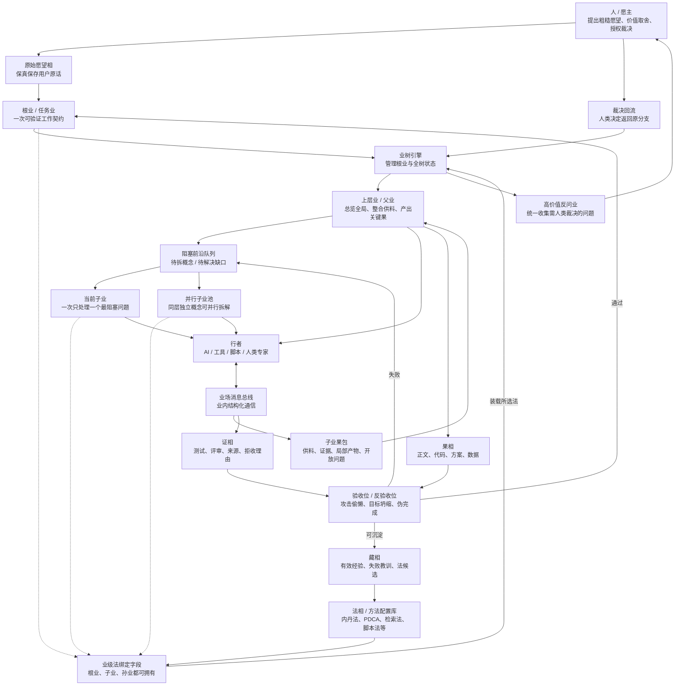
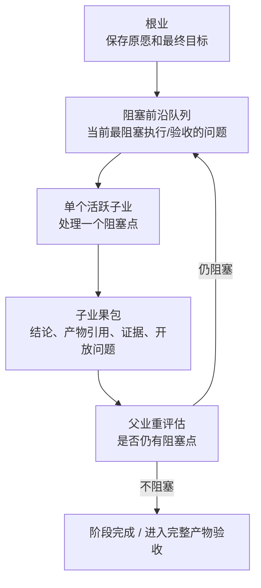
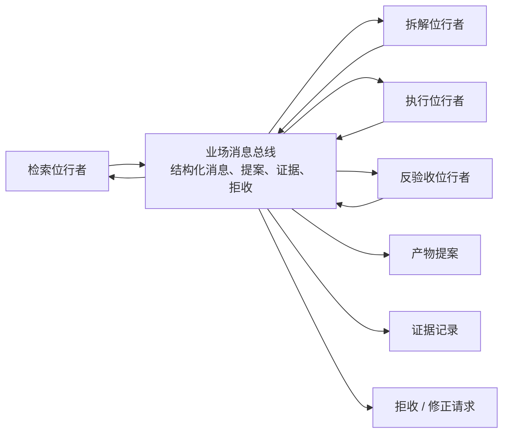

# 临时讨论：相业架构业引擎图文说明

> 状态：临时讨论稿，不是真相源。
> 用途：把当前关于相业架构、内丹法、业引擎、子业拆解、业内通信、验收回流的讨论整理成可画图、可继续推敲的架构草案。

## 1. 总体判断

当前讨论形成的基本判断是：

```text
相业架构负责语义和状态边界。
业引擎负责调度、分业、验收、回流和审计。
业引擎只负责基础机制，不内化具体法。
每一个业理论上都可以选择自己的法，也可以不选；根业只负责初始化法、默认继承策略和高层约束。
复杂任务中，不同业可以调用不同法，例如概念拆解用内丹法，资料检索用检索法，本地脚本执行用脚本法，过程管理用 PDCA。
内丹法等具体法都是可配置的法相，不是固定 prompt。
行者负责执行，不拥有系统真相。
果必须携证，验收失败必须回流。
高价值分支必须能够被统一收集、统一反问人类愿主，并把裁决回流到原分支。
业树引擎必须把根业也纳入管理，因为根业是整棵树的锚点、默认法来源和最终汇聚点。
需要全局一致性的核心产物不能随意下放给深层子业；上层业负责全局整合、关键产物和完成声明，子业负责供料、验证、局部确定性工作，或在清晰接口内执行局部产物。
```

这套设计的目标不是做一个更复杂的 workflow，也不是让 agent 自由递归，而是让低能力起点的用户能把粗糙愿望推进为可检查、可迭代、可交付的现实成果。

## 2. 总体结构图



## 3. 核心对象说明

| 对象 | 作用 | 关键边界 |
|---|---|---|
| 人 / 愿主 | 提供愿望、价值判断、授权和最终裁决 | 不被 AI 改写为系统目标 |
| 相 | 一切可保存、可引用、可版本化的稳定对象 | 文件只是存储后端，不是通信协议 |
| 业 | 一次有因、愿、律、法、行者、果、证的工作契约 | 不是 agent 会话，也不是固定流程节点 |
| 法 | 可配置方法，例如内丹法 | 不直接拥有状态迁移权 |
| 行者 | AI、工具、脚本、人类专家，承接业执行 | 不能自称完成，不能自由扩张任务树 |
| 果 | 产物，如正文、代码、方案、数据 | 果不等于完成，必须接受验收 |
| 证 | 为什么相信果成立或不成立 | 证也可被评审，不等于漂亮解释 |
| 藏 | 被验证后可复用的经验、失败教训、法候选 | 必须有来源、版本、范围和过期条件 |
| 业引擎 / 业树引擎 | 控制根业与整棵业树的状态、分业、验收、回退和审计，只提供基础机制 | 不是超级 agent，不替代语义判断，不内化具体法 |
| 高价值反问业 | 汇总需人类裁决的高价值分支问题并回流决策 | 不能被单个行者私自吞掉 |

## 4. 法的位置与内丹法示例

任何法都不应继续主要依赖 skill 文本自觉执行，而应成为可配置、可校验、可版本化的法相。  
内丹法只是当前重点讨论的示例法之一，不是业树引擎内置中心法。

以内丹法为例，它的配置应描述：

```text
如何保存原愿。
如何扫描已有法和材料。
如何识别阻塞概念。
如何递归下钻到动作、信号、失败信号、边界和反馈源。
如何生成原子动作。
如何要求完整产物。
如何验收。
如何在失败时回流或回退。
```

根业在立业时要先给出默认法与继承规则，再让业树引擎按业级法绑定契约去调度。  
但每个子业、孙业都可以在自己的契约里重新选择法、继承法或不选法。  
业树引擎不需要知道“内丹法怎么拆小说”或“PDCA 怎么做组织迭代”，它只需要知道如何装载法、记录状态、校验产物、触发回流。
同时，业树引擎不能把根业当成纯外部标签，它必须管理根业的生命周期、状态、默认法、失败回流和最终汇聚，因为树上所有分支都从根业派生并最终回到根业判断。

多种法可以嵌套使用，而且**任意法都应支持被其他法嵌套，也应支持再嵌套回其他法**。  
这里的 PDCA、内丹法、总结法都只是例子，不是特权法，也不是唯一的法层级。  
真正需要的是一个统一的“法调用帧”机制，让任意法都可以像函数一样被调用、返回、再调用。

嵌套关系应由根业和方法配置显式声明。例如：

```text
PDCA(外层循环)
  P: 调用内丹法做概念拆解和计划生成
  D: 调用执行法或领域法产出真实果
  C: 调用评审法/验证法检查产物
  A: 调用总结法/压缩法把有效方法沉淀为 skill 或新法候选
```

上面的例子不是说 PDCA 只能包内丹法。实际规则应该是：

```text
任意法 A 可以调用法 B。
法 B 在自己的执行中也可以再调用法 C。
法 C 甚至可以在受控条件下再次调用法 A。
```

因此会出现你说的这种情况：

```text
PDCA -> 内丹法 -> PDCA -> 内丹法 -> ...
```

它在语义上是允许的，但必须受三个约束：

1. 每次调用都要形成明确的法调用帧。
2. 每层都要有自己的输入、输出、验收和回流点。
3. 必须有预算、深度或重复检测，防止无限互相嵌套。

所以，内丹法只是计划阶段可调用的子法之一，而不是把所有外层循环都吞进去；反过来，内丹法内部也可以再调用 PDCA、总结法或其他法，只要该调用确实改善计划、执行、验收或沉淀。

### 4.1 法绑定是业级别的，不是根业垄断

每个业都应有自己的法绑定字段，例如：

```yaml
ye_id: ye_001_002
method_binding:
  mode: inherit | override | none
  selected_methods:
    - neidan.v1
    - web_research.v1
  reason: 本业同时需要概念拆解和外部资料检索
  fallback:
    - use_parent_method
    - use_default_method
```

含义如下：

| 模式 | 含义 |
|---|---|
| inherit | 默认继承父业方法 |
| override | 本业显式覆盖父业方法 |
| none | 本业不绑定具体法，只使用业引擎默认基础规则 |

这样，复杂任务里可以出现：

```text
根业：PDCA
  子业A：内丹法做概念拆解
  子业B：检索法查外部资料
  子业C：脚本法写并跑本地脚本
  子业D：总结法压缩为新 skill
```

根业不需要垄断法选择，只需要提供默认法和继承策略，避免方法混乱。

代码不应写死“怎么写小说”“怎么做软件”“怎么研究市场”，但必须写死元规则：

```text
不能目标坍缩。
不能概要冒充产物。
不能验收失败后结束。
不能 AI 自称通过。
不能无证沉淀长期经验。
不能让行者自由扩张任务树。
```

## 5. 多层拆解模型

内丹法需要多层级拆解，但多层级不等于多层 agent 递归。

推荐模型是：

```text
语义上：多层业网。
执行上：先用两层循环 + 阻塞前沿队列。
深挖时一个子业默认只处理一个阻塞问题。
同层独立概念可以拆成多个子业并行跑，但必须先定方法和计划。
```



这与完整父子孙业树在很多单分支场景中近似等价，但不完全等价：

| 模型 | 优点 | 风险 |
|---|---|---|
| 父子孙业树 | 上下文隔离更清楚，能保留多分支关系 | 引擎更复杂，分支管理成本高 |
| 两层循环 | 实现简单，状态更可控 | 若前沿队列设计不好，父业上下文会膨胀 |

当前建议先做最小版本：

```text
根业 + 业级法绑定 + 上层全局业 + 阻塞前沿队列 + 单活跃深挖子业 + 可选并行同层子业池 + 结构化回流包。
```

后续如果出现多分支并行、交叉依赖、长期分支保留，再升级为完整业网调度。

### 5.1 全局产物与子业边界

分业的目标是降噪和获得材料，不是把需要全局一致性的工作切碎到失去方向。

更准确的规则是：

```text
子业不能拥有全局完成声明。
需要全局一致性的核心产物，默认由上层业负责最终整合和定稿。
子业可以供料、验证、局部加工，也可以在接口清晰时完成局部产物。
父业或上层业负责检查局部产物是否破坏全局一致性。
```

三类工作应区别处理：

| 工作类型 | 处理方式 | 示例 |
|---|---|---|
| 全局一致性强的核心产物 | 留在上层业执行或最终定稿 | 长篇主线、整卷章节、核心架构重构、全局产品方案 |
| 局部确定性工作 | 子业执行 | 检索资料、扫描调用方、整理人物状态、运行测试、抽取伏笔 |
| 接口清晰的局部创作或实现 | 可交给子业执行，但必须有接口契约和合并验收 | 写某个支线场景初稿、实现已定义接口模块、补一个明确测试 |

这避免两个极端：

```text
过度下放：子业局部正确但全局迷失。
过度集中：父业重新变成超级 agent，所有工作都压在一个上下文里。
```

长篇小说中的合理形态：

```text
上层写作业：负责第 17 章的全局目标、人物弧线、伏笔回收和正文定稿。
  子业A：整理主角当前状态。
  子业B：列出本章必须回应的伏笔。
  子业C：检查世界规则限制。
  子业D：生成可用冲突素材。
  子业E：写一个接口清晰的局部场景初稿。
上层写作业：整合材料并完成最终章节正文。
```

大工程代码中的合理形态：

```text
上层重构业：负责核心模块边界、最终 diff 和完成声明。
  子业A：扫描调用方。
  子业B：整理接口契约。
  子业C：找测试入口。
  子业D：识别风险边界。
  子业E：实现一个已定义接口的小模块。
上层重构业：合并局部结果，运行全局验收。
```

最短规则：

> 上层业总览成事，子业供料证成；子业可以做局部产物，但不能宣告全局完成。

## 6. 分业机制

分业不应由行者自由决定，而应采用：

```text
AI 提议，代码守门，业引擎登记。
```

当分支只影响局部执行效率时，模型可以代理判断是否继续拆。  
当分支触及高价值选择、不可逆操作、价值冲突、授权边界或长期后果时，必须进入高价值反问业，由业统一收集问题并回流人类愿主裁决。

AI 可以提出分业申请：

```yaml
split_request:
  parent_ye_id: ye_001
  concept: 爆款
  reason: 阻塞小说产物验收
  proposed_child:
    objective: 拆解“爆款”到追读、点击、复述、分享等代理指标
    expected_output: 爆款代理指标表
    acceptance:
      - 有可观察信号
      - 有失败信号
      - 有文本动作
      - 有反馈来源
  risk_if_not_split: 后续产物只能用模糊“好看”验收
```

代码审核：

```text
是否阻塞父业执行。
是否阻塞父业验收。
是否能产出独立果。
是否有明确验收标准。
是否和已有子业重复。
是否超过深度、时间、成本预算。
是否可以直接复用已有法或藏。
是否只是装饰性概念拆分。
```

必须分业的情况：

```text
阻塞执行或验收。
需要外部检索、实验、代码运行、真实反馈。
需要不同位的行者。
产物足够大，继续放在父业会污染上下文。
验收失败原因指向一个可隔离问题。
全局业缺少某类材料、证据、局部实现或局部草稿，需要子业供给。
```

禁止分业的情况：

```text
只是为了概念完整性。
没有独立产物。
没有验收标准。
结果无法被父业消费。
已有法或已有藏可以直接解决。
需要全局一致性的核心完成声明被下放给深层子业。
```

### 6.1 高价值反问与人类裁决回流

高价值反问不是随便打断，而是由业树引擎统一管理的高价值问题收集器。

典型触发条件：

| 条件 | 含义 | 默认动作 |
|---|---|---|
| 高价值选择 | 不同答案会导致不同长期走向、责任或资产结果 | 先拦截，进入高价值反问业 |
| 不可逆操作 | 回滚代价高、影响外部世界或难以恢复 | 强制上交人类裁决 |
| 价值冲突 | 审美、偏好、伦理、授权、责任发生冲突 | 不让模型单独代理决定 |
| 高风险授权 | 需要花钱、发布、删除、对外承诺、访问敏感资源 | 必须问人 |
| 语义不确定但后果大 | 模型也无法给出足够可信的代理判断 | 暂停并汇总问题 |

高价值反问业应输出一个统一的裁决包：

```yaml
high_value_question_id: hvq_001
source_ye_id: ye_001_003
why_escalated: 该分支涉及不可逆选择和价值冲突
questions_to_human:
  - 这个分支是否要继续推进
  - 是否允许高风险路径
  - 是否需要拦截并改走保守方案
model_proxy_opinion:
  allowed: false
  reason: 超出代理决策阈值
decision_state:
  pending | approved | rejected | modified
return_path: 原分支
```

人类裁决后必须回流到原分支，不能只停留在“问过人了”。

### 6.2 大模型是否可以代理决策判断

可以，但只限于低价值、低风险、可逆、边界清晰的分支。

建议分层：

| 分支类型 | 模型可否代理 | 说明 |
|---|---|---|
| 低价值、低风险、可逆 | 可以 | 可在策略阈值内代理 |
| 语义清晰但需要局部效率判断 | 可以 | 例如是否继续拆一个不关键概念 |
| 高价值、不可逆、价值冲突 | 不可以 | 必须上交人类愿主 |
| 高风险授权 | 不可以 | 必须拦截 |

判断建议：

```text
should_escalate =
  high_value
  or irreversible
  or value_conflict
  or high_risk
  or proxy_confidence_low && impact_high
```

所以不是“模型能不能判断”，而是“模型能否在政策阈值内代理判断”。超阈值就必须反问人类。

## 7. 业内多行者通信

业内部多个行者可以通信，但不能自由群聊改状态。



业内通信的规则：

```text
业内用消息总线协作。
业间用果包交接。
状态迁移只由业引擎执行。
自由对话不能直接改变业状态。
```

消息应是结构化事件，例如：

```yaml
msg_id: msg_001
ye_id: ye_neidan_001
from:
  xingzhe_id: researcher_1
  wei: 检索位
to:
  wei: 拆解位
type: evidence_ready
intent: 提供证据
payload:
  summary: 找到 3 类网文黄金三章结构
artifact_refs:
  - art_ref_123
evidence_refs:
  - ev_456
requires_response: false
visibility: ye_internal
ttl: current_round
```

## 8. 业间通信

业之间不应直接传文件，也不应共享一个大文件。业间传递的是结构化果包：

```yaml
ye_id: ye_001
status: accepted
outputs:
  - artifact_id: art_novel_ch1_v3
    type: text.chapter
    version: 3
    uri: artifacts/art_novel_ch1_v3.md
    hash: sha256:...
claims:
  - claim_id: c1
    text: 第一章已完成完整正文
    evidence_refs: [ev_001, ev_002]
context_return:
  summary: 本业完成第一章正文，但缺真实读者反馈。
  key_decisions:
    - 使用“第七孵化所”作为书名
  open_questions:
    - 是否继续写完整黄金三章
```

文件可以作为相的存储后端，但不应成为通信协议。下游业读取的是 artifact 引用、版本、hash、摘要、声明、证据和开放问题。

如果该果包来自子业，还必须说明它是：

```text
供料。
验证结果。
局部确定性产物。
接口清晰的局部创作或实现。
```

子业果包不能写成“全局完成”，除非它本身就是根业或被上层业显式授权为最终合并业。

## 9. 验收与失败回流

验收不是结尾说明，而是控制信号。

核心规则：

```text
核心验收不通过，不得结束。
完整产物不完整，不得通过。
代码没运行，不能说软件可用。
章节没正文，不能说黄金三章完成。
AI 自评不能冒充外部反馈。
```

失败后必须进入一种状态：

```text
修正：当前产物可修，生成修正业。
回退：当前路径错误，回到上一个有效检查点。
补证：产物可能成立，但缺测试、来源、读者反馈或运行证据。
仲裁：涉及价值选择、风险授权或高分歧，需要人类裁决。
废弃：该法、该产物或该路径被证据否定。
```

## 10. 业引擎最小实现

第一版不要做完整复杂图引擎。建议最小组件如下：

```text
YeStore：保存业契约和状态。
RootRegistry：保存根业身份、默认法、树锚点和全树生命周期信息。
ArtifactStore：保存果和证的引用。
FrontierQueue：保存当前阻塞前沿。
MethodBinder：按业级字段装载、继承、覆盖或空置方法。
SplitGate：审核 AI 分业申请。
EscalationGate：判断是否进入高价值反问业。
HumanQuestionQueue：汇总并管理发给人类愿主的高价值问题。
Scheduler：调度当前活跃子业。
ParallelChildPool：调度同层独立子业并行运行。
Validator：检查产物、证据和失败项。
GlobalMergeGate：检查局部子业结果是否破坏上层全局一致性。
DecisionRouter：把人类裁决回写到原有分支。
AuditLog：只追加记录关键事件。
ContextPacker：按业契约装载最小必要材料、供料引用和禁改边界，不替代供料子业。
```

最小运行过程：

```text
原愿进入
  -> 立根业
  -> 设置根业默认法与继承策略
  -> 按业级法绑定加载所选法配置
  -> 业树引擎登记根业并建立树锚点
  -> 生成阻塞前沿队列
  -> 激活一个子业
  -> 行者执行
  -> 子业返回果包
  -> 上层业整合供料或局部产物
  -> 验收位检查
  -> 父业重评估
  -> 继续拆解 / 生成完整产物 / 回退 / 仲裁
```

## 11. 当前仍未解决的问题

这些问题不能用概念直接跳过，后续要用实验回答：

```text
阻塞前沿队列如何排序，防止 AI 只挑容易项。
分业深度和预算如何限制。
父业如何避免积累过长上下文。
哪些工作应留在上层业，哪些工作可以下放给子业。
子业局部产物如何通过全局合并验收。
哪些消息应升级为相，哪些只留在业内消息录。
验收位如何避免和执行位互相顺从。
法如何从一次失败中修正，而不是过度拟合。
什么时候两层循环不够，需要升级完整业网。
不同法如何在各级业中组合、嵌套和切换。
高价值反问的阈值如何标定，避免过度打扰和漏拦截。
```

## 12. 当前结论

当前最稳妥的实现路线是：

```text
先做相业语义上的最小业引擎。
让业树引擎管理根业与全树生命周期。
把法选择做成业级字段，根业负责默认和继承策略，不垄断所有法选择。
用两层循环执行多层拆解。
把全局一致性强的核心产物留在上层业整合和定稿。
用法调用帧支持任意法的嵌套和互相嵌套。
用结构化果包避免文件地狱。
用业内消息总线避免自由群聊。
用高价值反问业把高价值分支主动交还人类愿主。
用验收失败回流避免 AI 自称完成。
等单活跃子业模型跑通，再升级复杂业网。
```

最短表达：

> 相业架构负责语义，业树引擎负责控制，法负责方法，行者负责执行，证据负责纠偏；上层业总览成事，子业供料证成，内丹法只是可被调用的一种法。
