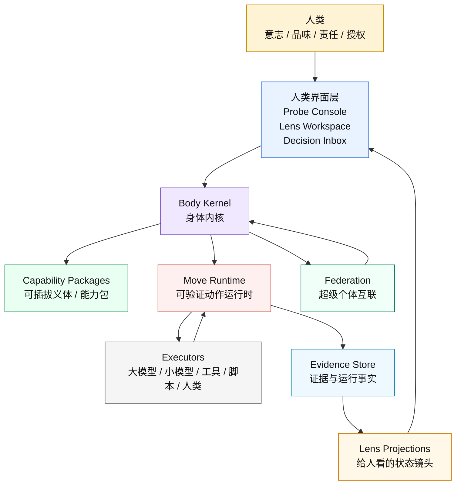
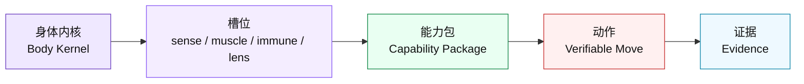
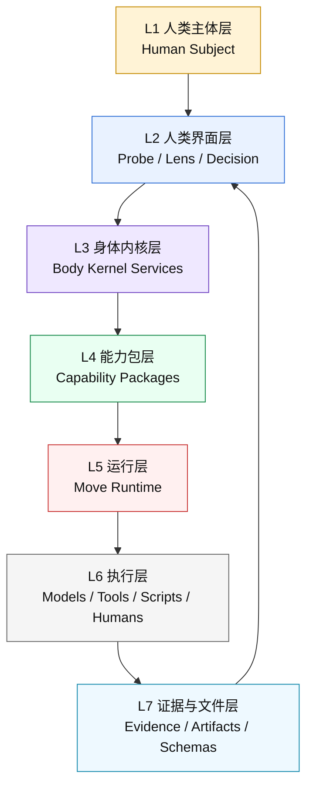
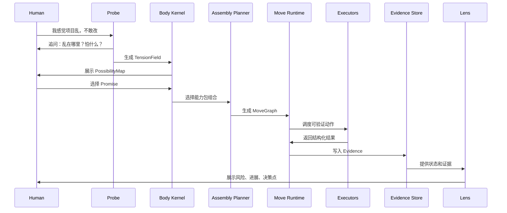
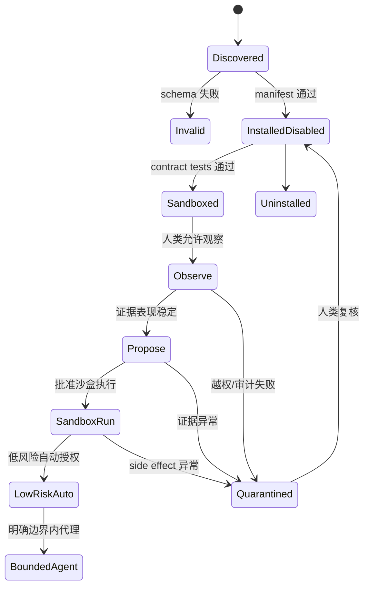
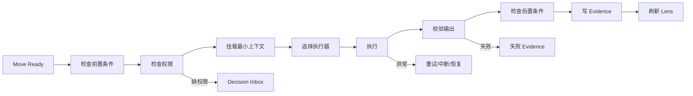
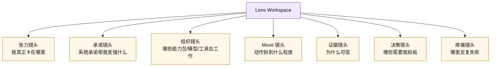
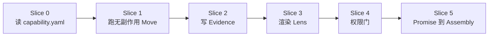

# 图文版架构导览

> 状态：历史参考。当前真相源已经迁移到 `../00-当前真相源-人工智能软件社会相业架构.md`。
>
> 本文仍保留“身体内核 / 能力包 / 可验证动作”阶段的思考痕迹，但不再作为最新判断入口。
>
> 阅读目的：让人类先看懂主次，再决定是否进入 `03/04/05` 的长文细节。
>
> 本文不是当前真相源，而是前一阶段真相的可视化入口。旧阶段细节以 `03-超级个体外骨骼与能力集群真相.md`、`04-能力包协议与可验证动作原子化.md`、`05-身体内核与能力包软件架构方案.md` 为准。

## 0. 一句话

我们不是做一个“万能 AI 助手”。

我们做的是：

> 一个文件原生的第二身体内核，能装载、治理、组合、运行和观察各种能力包，让人类把模型、工具、技能和其他超级个体组织成可控的能力集群。

## 1. 先看这张总图



## 2. 主次关系

### 2.1 最重要的 5 个判断

| 优先级 | 判断 | 含义 |
|---:|---|---|
| 1 | 做身体，不做单个义体 | 核心是装载能力包的框架，不是某个“创业助手”。 |
| 2 | 做协议，不做堆功能 | 能力包、Move、Evidence、Lens、权限都要有协议。 |
| 3 | 做可验证动作，不做大而空任务 | 复杂工作必须拆到可调度、可检查、可复盘。 |
| 4 | 做 Lens，不做配置表地狱 | UI 是观察镜头，不是真相源。 |
| 5 | 做人类增强，不做模型替人 | 人类保留意志、品味、价值判断、授权和责任。 |

### 2.2 什么是“身体”，什么是“义体”



| 概念 | 类比 | 负责什么 | 不负责什么 |
|---|---|---|---|
| `Body Kernel` | 身体/神经底座 | 装载、权限、运行、证据、镜头、联邦。 | 不内置具体业务助手。 |
| `Capability Package` | 义体 | 提供某类可插拔能力。 | 不直接拥有权限。 |
| `Slot` | 义体接口 | 限定能力包能插到哪里。 | 不表达业务场景。 |
| `Verifiable Move` | 神经脉冲 | 最小可验证动作。 | 不承载完整任务。 |
| `Lens` | 感官镜头 | 给人类看状态。 | 不写真相。 |

## 3. 系统分成哪几层



### 3.1 分层速查

| 层 | 主要对象 | 输入 | 输出 | 一句话职责 |
|---|---|---|---|---|
| 人类主体层 | `HumanSubject` | 痛点、判断、授权 | 决策、否决、修正 | 保留意志和责任。 |
| 界面层 | `ProbeConsole`、`LensWorkspace` | 人类表达、Lens Projection | 追问、展示、决策请求 | 帮人看懂和介入。 |
| 身体内核层 | `BodyKernel` | 请求、包、权限、上下文 | 运行计划、证据、镜头 | 系统的操作系统。 |
| 能力包层 | `CapabilityPackage` | context、permission、schema | Move 定义、Lens、测试 | 可插拔义体。 |
| 运行层 | `MoveRuntime`、`MoveGraph` | Assembly、Move | 状态、checkpoint、Evidence | 可恢复地运行动作。 |
| 执行层 | Executors | Move input | Move output | 真正干活。 |
| 文件证据层 | Evidence、Artifact、Schema | 运行事实 | 可追溯证据 | 系统真相落地。 |

## 4. 一次请求如何流转

### 4.1 从模糊痛点到可执行动作



### 4.2 每一步的产物

| 阶段 | 产物 | 说明 |
|---|---|---|
| 表达痛点 | `raw_signal` | 用户不需要说清任务。 |
| 主动追问 | `TensionField` | 显影真实张力。 |
| 展开可能 | `PossibilityMap` | 不急着变成工作流。 |
| 建立承诺 | `PromiseContract` | 系统承诺增强什么能力。 |
| 选择义体 | `CapabilityAssembly` | 哪些能力包参与。 |
| 设计动作 | `MoveGraph` | 大模型统领拆动作。 |
| 执行动作 | `MoveResult` | 小模型、工具、脚本执行。 |
| 记录事实 | `EvidenceRecord` | 可复盘和审计。 |
| 展示状态 | `LensProjection` | 给人类看主次。 |

## 5. 核心对象卡片

### 5.1 `BodyKernel`

> 系统的操作系统。

| 项 | 内容 |
|---|---|
| 它是什么 | 装载能力包、管理权限、运行 Move、保存证据、渲染 Lens 的核心。 |
| 它接收 | 用户请求、Promise、能力包、权限请求、运行事件。 |
| 它输出 | Assembly、MoveGraph、Evidence、LensProjection、DecisionRequest。 |
| 它不做 | 不内置具体业务助手，不越权执行。 |

### 5.2 `CapabilityPackage`

> 可插拔义体。

| 项 | 内容 |
|---|---|
| 它是什么 | 一个文件夹，声明能力、槽位、Move、Lens、权限、schema、测试。 |
| 它接收 | 被挂载的上下文、授权后的工具、Move 输入。 |
| 它输出 | Move 定义、执行产物、证据、镜头定义。 |
| 它不做 | 不直接获得权限，不直接写系统真相。 |

### 5.3 `VerifiableMove`

> 最小可调度动作。

| 项 | 内容 |
|---|---|
| 它是什么 | 输入小、输出小、可检查、可重试、可归因的动作。 |
| 它接收 | 明确输入、schema、权限、执行器。 |
| 它输出 | 结构化结果和 Evidence。 |
| 它不做 | 不承载完整任务，不隐藏副作用。 |

### 5.4 `EvidenceRecord`

> 运行事实。

| 项 | 内容 |
|---|---|
| 它是什么 | 每个 Move 的输入、输出、执行器、状态、错误、副作用、验证结果。 |
| 它接收 | Runtime 写入的结构化运行事实。 |
| 它输出 | Lens、审计、恢复、复盘的依据。 |
| 它不做 | 不等于普通日志，不被能力包直接删除。 |

### 5.5 `Lens`

> 人类观察系统的镜头。

| 项 | 内容 |
|---|---|
| 它是什么 | 从 Evidence、RunState、Decision 中生成的人类可读投影。 |
| 它接收 | 证据、状态、权限、决策、疼痛信号。 |
| 它输出 | 风险图、进展图、证据图、决策列表。 |
| 它不做 | 不拥有状态，不直接执行动作。 |

## 6. 能力包如何装载



### 6.1 装载门槛

| 门槛 | 目的 |
|---|---|
| manifest schema | 确认包结构合法。 |
| move schema | 确认可执行动作可验证。 |
| permission declaration | 确认需要哪些权力。 |
| contract tests | 确认包不是纸面能力。 |
| sandbox dry run | 确认不会直接伤害环境。 |
| human approval | 确认人类愿意授权。 |

## 7. Move 如何执行



### 7.1 执行器分工

| 执行器 | 适合做 | 不适合做 |
|---|---|---|
| 大模型 | 统领、规划、综合、审计、反方。 | 批量搬运、格式化、可规则处理的小活。 |
| 中模型 | 草拟、比较、局部评审。 | 高风险战略裁决。 |
| 小模型 | 抽取、分类、打标签、结构化。 | 价值判断和复杂综合。 |
| 工具/脚本 | 扫描、运行、校验、转换。 | 模糊判断。 |
| 人类 | 品味、价值、授权、最终裁决。 | 重复体力劳动。 |

## 8. UI 应该长什么样

不是一个大表单，也不是一个工作流画布优先。

它应该是镜头工作台：



### 8.1 镜头主次

| 镜头 | 人类要回答的问题 |
|---|---|
| 张力镜头 | 我真正要解决的痛点是什么？ |
| 承诺镜头 | 系统承诺推进什么？我保留什么控制权？ |
| 组织镜头 | 哪些义体、模型、工具、人正在参与？ |
| Move 镜头 | 任务有没有拆到可验证？ |
| 证据镜头 | 结果为什么可信？ |
| 决策镜头 | 现在需要我决定什么？ |
| 疼痛镜头 | 系统哪里做得不好，需要进化？ |

## 9. 文件结构一眼看懂

```text
.body/
  body.yaml                 # 这个身体是谁、启用了什么内核策略
  schemas/                  # 所有协议的机器校验规则
  packages/installed/       # 已安装能力包，也就是义体
  instances/                # 某个义体在本身体上的装载状态
  permissions/              # 权限请求、批准、撤销
  trust/                    # 能力包信任等级
  context/                  # 挂载给动作的最小上下文
  promises/                 # 系统对人类的承诺
  assemblies/               # 某次承诺选择了哪些能力包
  runs/                     # 每次运行的状态、证据、产物
  lenses/projections/       # 给人看的状态投影
  memory/                   # 经处理的记忆，不是聊天记录
  pain/                     # 疼痛信号
  mutations/                # 改进提案
  federation/               # 超级个体协作接口
```

## 10. 应该先做什么



### 10.1 第一阶段最小闭环

> 不做 UI 大工程。先证明“身体能装载一个义体并运行一个无副作用动作”。

```text
读取 capability.yaml
  -> 校验 manifest
  -> 校验 moves
  -> 检查权限
  -> 运行一个无副作用 Move
  -> 产出 Evidence
  -> 用 Lens 渲染状态
```

## 11. 阅读路径

### 11.1 10 分钟读懂

1. 本文 `0-3`：知道我们到底做什么。
2. 本文 `4-8`：知道对象、流程、UI 主次。
3. 本文 `10`：知道第一步怎么落地。

### 11.2 进入设计细节

| 想看什么 | 去哪里 |
|---|---|
| 为什么要做这个 | `03-超级个体外骨骼与能力集群真相.md` |
| 能力包协议 | `04-能力包协议与可验证动作原子化.md` |
| 软件架构类设计 | `05-身体内核与能力包软件架构方案.md` |
| 旧脑暴来源 | `01` 和 `02` |

## 12. 反向检查

如果一个设计让你看起来又“假大空”，用这张表检查：

| 问题 | 如果答不上来，说明还太空 |
|---|---|
| 它是身体内核，还是某个义体应用？ | 分不清就会做成万能助手。 |
| 能力包 manifest 是什么？ | 没有 manifest 就不可装载。 |
| 最小 Move 是什么？ | 没有 Move 就不可验证。 |
| Evidence 写在哪里？ | 没有证据就不可复盘。 |
| 需要哪些权限？ | 没有权限边界就危险。 |
| 人类在哪个 Lens 里决策？ | 没有 Lens 就会变成配置地狱。 |
| 如何卸载或降级？ | 不能卸载就不是义体。 |
